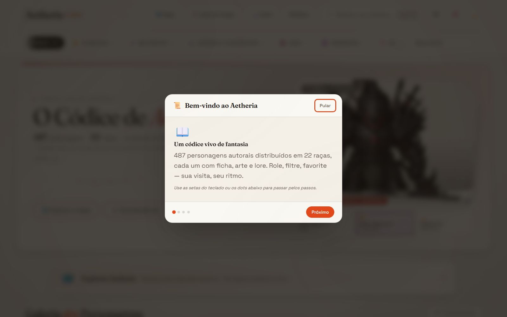
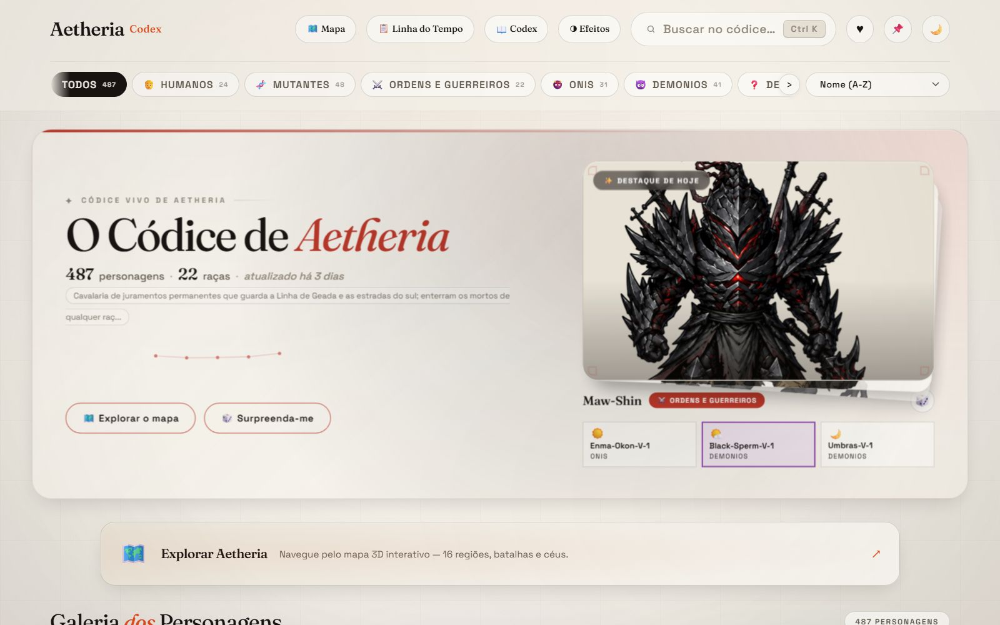
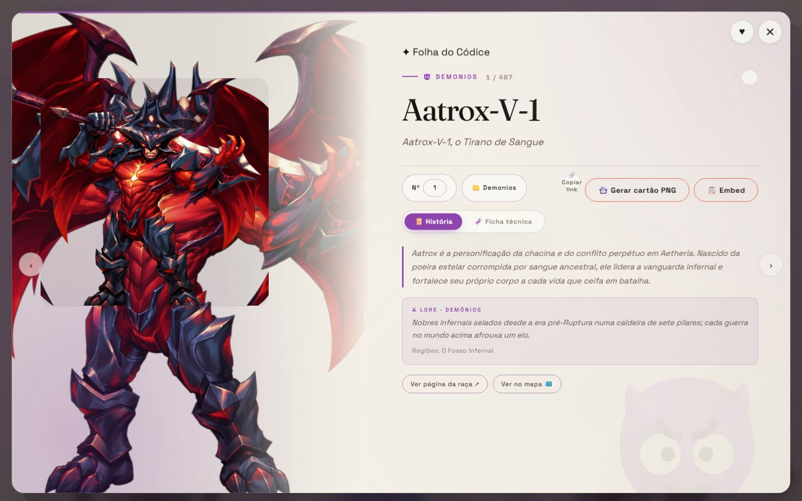
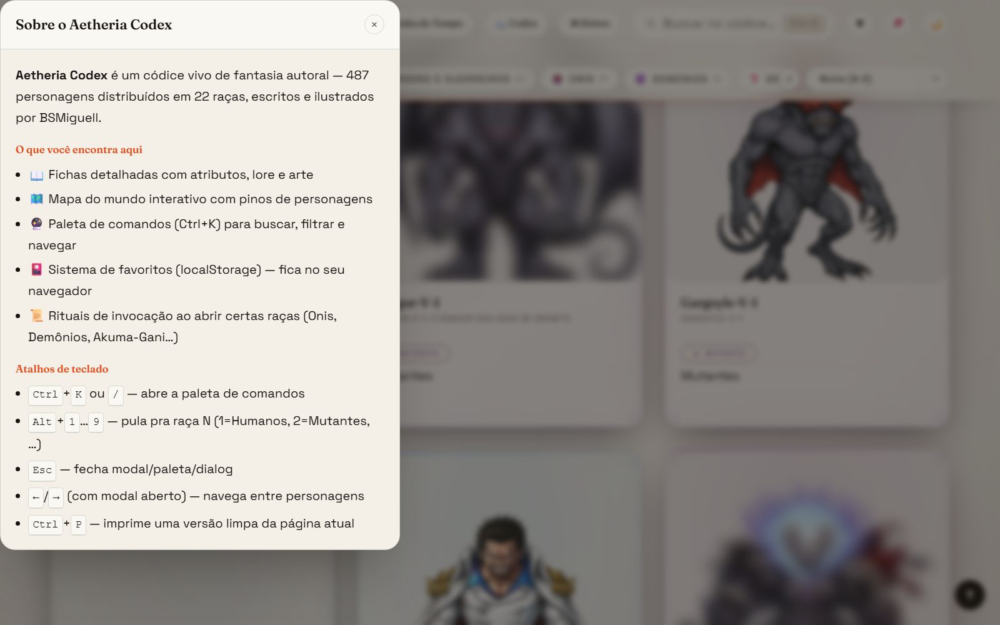
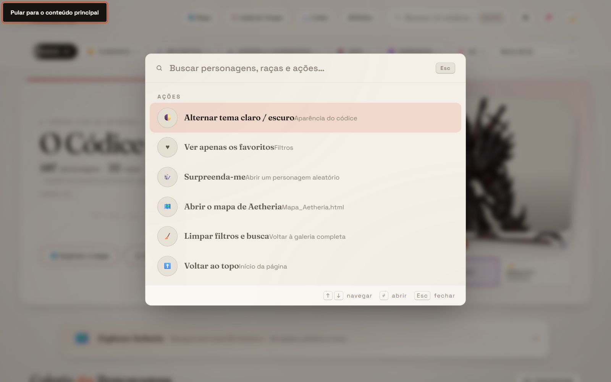
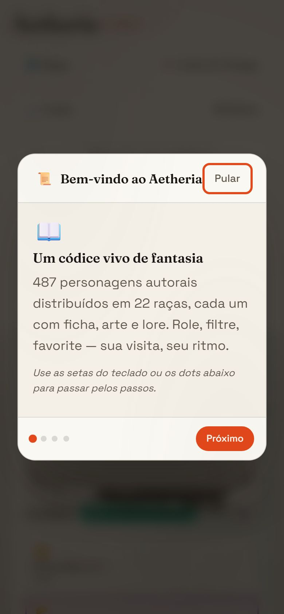
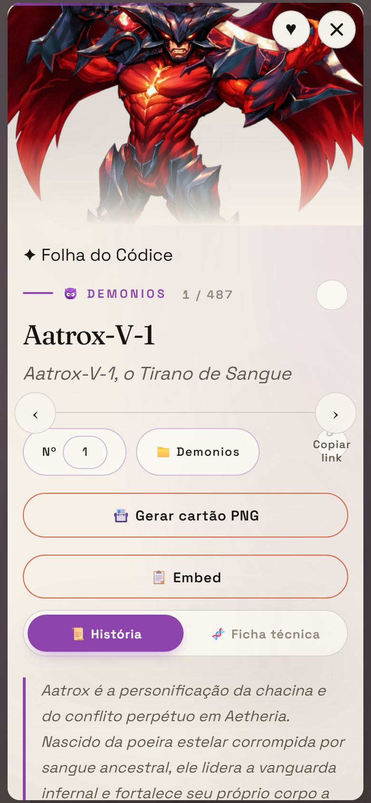
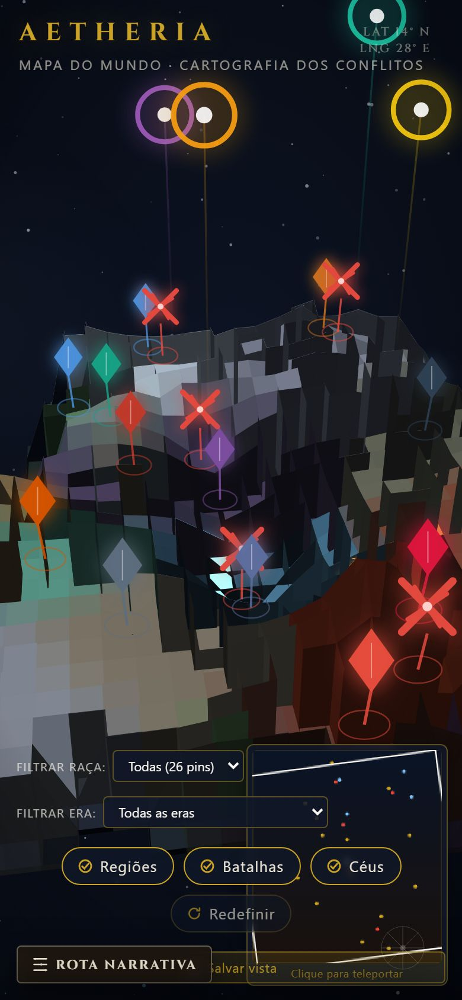
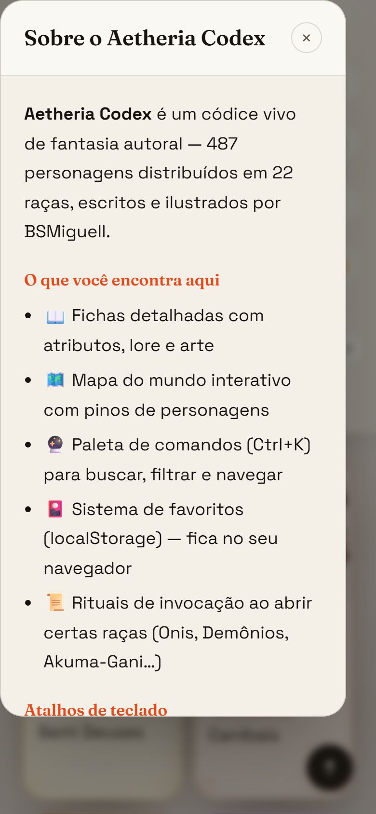

# README - Aetheria Codex

> 🤖 **Para assistentes de IA (Claude e similares):** ao iniciar uma conversa sobre este projeto, leia este README por inteiro para entender a estrutura, E DEPOIS LEIA [`Memoria.md`](Memoria.md) — é a linha do tempo oficial com todas as alterações, erros já resolvidos, lições técnicas (armadilhas de PowerShell 5.1) e pendências. Ao terminar qualquer manutenção, adicione uma entrada lá com data/hora e commit.

> 💡 **Prompt sugerido para iniciar uma nova conversa:** _"Leia o README.md e o Memoria.md deste projeto para absorver todo o contexto antes de qualquer tarefa."_

---

## O que é este projeto

**Aetheria Codex** é um códice de personagens de fantasia autoral: **487 personagens** distribuídos em **22 categorias/raças**, cada um com ficha em Markdown (história + descrição visual detalhada) e arte `.png`. Sobre esse acervo roda um site galeria estático — sem backend, sem dependências, só HTML/CSS/JS puro.

O fluxo é: **fichas `.md` nas pastas → scripts PowerShell geram `characters-api.json` e `README.md` → `index.html` consome a API JSON**.

## 📸 Galeria do Site

**Home — hero com stats e destaque do dia** (tema claro): contadores animados (487 personagens · 22 raças), destaque determinístico pelo dia do ano (com reroll 🎲) e CTAs para o mapa e "Surpreenda-me".


**Cards "Carta do Códice"** (tema escuro): moldura de manuscrito com cantos que crescem no hover, tilt 3D, foil holográfico que segue o ponteiro, filete e badge na cor da raça, blur-up das artes.


**Filtro por raça:** chips compactos em linha rolável; o ativo é preenchido com a cor da categoria (aqui Onis) e a seleção fica na URL (`#g=04_Onis`) — deep-link compartilhável.


**Modal folheável:** morf card→modal (View Transitions), abas 📜 História (com lore da raça) e 🧬 Ficha técnica, navegação ‹ › + teclas ←→ com contador "N / M", copiar link e focus trap.


**Paleta de comandos (Ctrl+K ou /):** busca fuzzy insensível a acentos com ranking global — personagens, raças e ações no mesmo resultado (digitar "aat" já traz o Aatrox).


**Mapa "Mesa de Guerra Arcana":** mundo 3D em Canvas 2D puro (sem bibliotecas), câmera orbital (arrasto/roda/pinça) e 26 pins — 16 regiões, 5 batalhas e 5 céus — alimentados pelo `historia-api.json`.


**Outros ângulos da câmera orbital** — arrastar gira e inclina o mundo; aqui em vista girada, com os penhascos do relevo em primeiro plano e a geleira à direita:


**Pin selecionado:** o painel lateral traz a lore do local (aqui as Cavernas de Obsidiana, casa dos Onis) e o chip HABITANTES com a contagem de personagens — clicável, leva à galeria já filtrada.


**Vista rasante:** com a câmera quase na horizontal o relevo aparece de perfil — penhascos em silhueta, vulcão com lava emissiva e os pins dos céus flutuando sobre o mundo.


**Página de raça** (1 das 22, todas geradas por `scripts\\build_racas.ps1`): herói rotativo com autoplay, reveal por caractere, tilt/glare na arte, chips de atributos e deep-link por personagem.


**Acervo da raça:** todos os membros clicáveis (abrem o herói), navegação entre as 22 raças e dados embutidos na própria página — funciona até abrindo o arquivo direto (`file://`).


## ✨ Features Q4/2026 — Galeria Visual

Capturas dedicadas das **17 funcionalidades entregues no ciclo Q4/2026** — cada bloco descreve **o que o usuário vê** + **como a captura foi produzida**. Para os detalhes internos de cada feature, ver "🖥️ Como as Telas Funcionam" abaixo (mesmo marcador §X.X).

### A. Onboarding & Descoberta (desktop)

**Toast instrutivo do botão "📲 Instalar"** — detecção adaptativa por UA, com 3 variantes (Chromium, iOS Safari, fallback) e micro-copy distinta por engine.


_Mecanismo:_ o IIFE `installPwa()` (`index.html` ~linha 3303) testa `beforeinstallprompt` (Chromium), `navigator.standalone` (iOS) e cai num toast genérico nos demais; aparece em 7s e some sozinho, só na 1ª visita.
_Implementação:_ capturado com `page.evaluate(() => localStorage.clear())` + reload, viewport 1600x1000, servidor :8080; o Chromium dispara `beforeinstallprompt` mesmo sem o usuário instalar.
_Tecnologias:_ `beforeinstallprompt` event, `e.preventDefault()` (sem isso o Chrome mata o gatilho nativo), `navigator.standalone`, `setTimeout(..., 7000)`, classes `.toast`/`.toast--ios`/`.toast--fallback`.
_Decisão:_ iOS não dispara `beforeinstallprompt` — sem o toast instrutivo, o usuário iOS nunca descobriria "Compartilhar → Adicionar à Tela de Início" (§3.3 Q4).

**Onboarding 4 passos — tela 1 (Bem-vindo)** — overlay central com 4 dots, botões prev/next/skip, micro-copy de boas-vindas.


_Mecanismo:_ `<div id="onboardOverlay">` em `position:fixed` com backdrop `rgba(0,0,0,.65)`; o passo atual (1/4) é destacado e o progresso fica visível nos 4 dots animados.
_Implementação:_ capturado com `localStorage.removeItem("aetheria.onboarded")` + reload (Playwright), viewport 1600x1000, sem flag de pupulação — é a 1ª visita real.
_Tecnologias:_ `localStorage["aetheria.onboarded"]` com `version:"1"` (só mostra de novo se `version !== "1"`), `.is-active` na `.onboard-step[n]`, `@keyframes onboardFadeIn`.
_Decisão:_ 4 passos com 4 saídas (Pular / Esc / backdrop / último Next = "Começar a explorar") para respeitar tanto apressados quanto curiosos — todos persistem em `localStorage` (§4.3 Q4).

**Onboarding 4 passos — tela 2 após click em Next** — mesma estrutura, micro-copy de "Explore o códice", dot 2/4 ativo.


_Mecanismo:_ o click em Next incrementa o índice, troca o conteúdo do overlay e move o dot ativo com transição CSS de `transform: translateX`; o estado do passo é local (não persiste até o último Next).
_Implementação:_ capturado com `page.click("#onboardNext")` + `waitForTimeout(300)` (Playwright) para garantir a transição antes do screenshot.
_Tecnologias:_ mesmo overlay do passo 1, `aria-live="polite"` no conteúdo, foco automático no botão Next para navegação por teclado.
_Decisão:_ a animação do dot é a única pista visual de progresso — sem ela, o usuário não saberia que ainda há 2 passos (§4.3 Q4).

**Skip-link a11y (Tab pressionado na home)** — o link "Pular para conteúdo principal" aparece no canto superior esquerdo, com outline visível.


_Mecanismo:_ o `<a href="#mainContent" class="skipLink">` é o primeiro elemento focável do `<body>`; ao receber foco ele ganha `transform: translate(0,0)` e outline `:focus-visible`.
_Implementação:_ capturado com `page.keyboard.press("Tab")` logo após o `goto`, em viewport 1600x1000, sem mouse — só o foco de teclado ativa o link.
_Tecnologias:_ `:focus-visible`, `transform: translateY(-100%)` → `translateY(0)`, atributo `id="mainContent"` no `<main>`, ARIA `aria-label="Pular para conteúdo principal"`.
_Decisão:_ WCAG 2.4.1 (Bypass Blocks) — o usuário de teclado/tecnologia assistiva pula a navegação sem tabular por 30+ chips antes do conteúdo (§4.1 Q4).

### B. Galeria Aprimorada (desktop)

**Diário de Páginas expandido: 3 mini-cards por período** — Manhã/Tarde/Noite abaixo do destaque principal; o card do período atual tem borda tingida na cor da raça.


_Mecanismo:_ o seed do dia (YYYY-MM-DD) gera 3 personagens determinísticos (1 por período: ☀️ Manhã 5-12h / 🌤️ Tarde 12-18h / 🌙 Noite 18-5h); o card do período corrente (baseado no horário local) recebe classe `.is-now` com borda + fundo na cor da raça dele.
_Implementação:_ capturado com `page.addInitScript(() => { Date.now = () => 1700000000000 })` no Playwright para forçar 14h, mostrando a Tarde ativa; screenshot full-viewport 1600x1000.
_Tecnologias:_ `Intl.DateTimeFormat().hour`, hash determinístico sobre `seed + periodIndex`, CSS `border: 2px solid var(--race-color)` via `themes.json`.
_Decisão:_ 1 destaque → 3 opções reduz a fricção de reroll manual; o usuário sempre vê um personagem "do seu turno" sem precisar clicar 🎲 (§4.5 Q4).

**Modal scrollado mostrando os 3 botões Share / Copiar link / Embed** — ações de compartilhamento do personagem, cada uma com ícone e micro-copy próprios.


_Mecanismo:_ os 3 botões ficam no rodapé da ficha técnica do modal: `#modalShare` usa Web Share API, `#modalShareBtn` usa Clipboard API, `#embedBtn` gera `<iframe>` 400×500 com `loading="lazy"`. Toast de confirmação em todos.
_Implementação:_ capturado com `page.click(".character-card")` para abrir o modal, depois `page.evaluate(() => { const m = document.querySelector("#modal"); m.scrollTop = m.scrollHeight; })` para revelar os 3 botões.
_Tecnologias:_ `navigator.share({title, text, url})`, `navigator.clipboard.writeText(url)`, `URL.createObjectURL` para o `<iframe>` blob, toast genérico `.toast--success`.
_Decisão:_ 3 caminhos cobrem 3 públicos (mobile share, link copy para chat, embed para blog/wiki) — Web Share sozinho exclui desktop e quem quer embedar (§4.4 Q4).

**Dialog "Sobre" do footer** — `<dialog>` nativo com 4 seções (contagens vivas, lista de features, atalhos de teclado, "como tudo é construído").


_Mecanismo:_ `<dialog id="aboutDialog">` aberto por `showModal()` via click no `#aboutLink`; Esc / click-fora / × fecham; scroll travado no `<body>` enquanto aberto.
_Implementação:_ capturado com `page.click("#aboutLink")` + `waitForSelector("#aboutDialog[open]")` em viewport 1600x1000.
_Tecnologias:_ HTML `<dialog>` (não `<div role=dialog>`), `dialog::backdrop`, contador animado `requestAnimationFrame`, atalhos listados com `<kbd>`.
_Decisão:_ `<dialog>` nativo dá focus trap + Esc de graça; reimplementar com JS puro seria esquecer a borda semântica e provavelmente o backdrop (§5.5 Q4).

**Paleta de comandos aberta (Ctrl+K)** — busca fuzzy com ranking global, 3 tipos no mesmo resultado (personagens, raças, ações).


_Mecanismo:_ modal central com `<input>` focado automaticamente; cada keystroke recalcula o ranking fuzzy insensível a acentos e rerenderiza a lista agrupada por tipo (desempate: personagem > raça > ação).
_Implementação:_ capturado com `page.keyboard.press("Control+k")` (ou `Meta+k` no macOS); o input "aat" foi digitado para mostrar o Aatrox no topo do ranking.
_Tecnologias:_ ARIA `role="combobox"`, matching fuzzy com normalização NFD + remoção de diacríticos, `aria-activedescendant` + live region.
_Decisão:_ "aat" traz o Aatrox entre Demônios — provar que a busca é global, não escopada por filtro ativo, é o que diferencia a paleta de um `<select>` comum.

### C. Mapa & Linha do Tempo (desktop)

**Mapa com filtro de raça (Onis) ativo** — pins das outras raças esmaecidos, chip "Onis" destacado com a cor canônica.


_Mecanismo:_ o chip de filtro aplica `opacity:0.25` aos pins cujo `data-race` não bate com a raça selecionada, com transição CSS de 200ms; o chip ativo é preenchido com a cor de `themes.json`.
_Implementação:_ capturado via `page.evaluate(() => location.hash = "#04_Onis")` (deep-link) + reload, depois `window.__MAPA__.abrir("Cavernas_de_Obsidiana")` no console para pré-abrir o painel da região dos Onis.
_Tecnologias:_ querySelector sobre `g[data-race]`, custom property `--race-onis`, hashchange listener, API de diagnóstico `window.__MAPA__` (`abrir`, `camera`, `estado`, `ids`, `exportarVista`).
_Decisão:_ o filtro via hash fecha o circuito mapa ↔ galeria ↔ APIs — o mesmo `#<folder>` funciona nos dois lados (§6.3 Q4).

**Linha do Tempo narrativa do mundo** — 4 atos cinematográficos com Ken Burns nos quadros de batalha, do ano 0 ao ano 12.


_Mecanismo:_ página dedicada com timeline horizontal scrollável; cada ato é uma seção fullscreen com parallax sutil e revel por caractere nos títulos.
_Implementação:_ capturado em `Linha_do_Tempo.html` servido por `python -m http.server 8080`, viewport 1600x1000, com scroll para o início do Ato 2 (Guerra da Fenda) para mostrar um quadro de batalha.
_Tecnologias:_ `historia-api.json` (mesma fonte do mapa), `assets/timeline.css` + `assets/timeline-data.js`, `requestAnimationFrame` para o Ken Burns, `IntersectionObserver` para o reveal.
_Decisão:_ consome a mesma `historia-api.json` do mapa — mudar a lore em `Aetheria_Dados_do_Mundo.md` reflete nos dois sem retrabalho (§9.1 Q4).

### D. Mobile (390×844) — paridade das features

Todas as 7 capturas abaixo comprovam que **nada do Q4/2026 é só desktop** — onboarding, filtros, modal, paleta, mapa, timeline e about dialog têm paridade responsiva.

**Onboarding mobile (390×844)** — mesmo overlay de 4 passos, mas o conteúdo ocupa quase toda a viewport; botão Next com target ≥44px.


_Mecanismo:_ o overlay usa `width: min(92vw, 480px)` e padding maior; os botões ficam empilhados verticalmente para acomodar o polegar.
_Implementação:_ capturado em viewport 390×844 (iPhone 14), `localStorage.removeItem("aetheria.onboarded")` + reload, `isMobile: true` + `hasTouch: true` no contexto Playwright.
_Tecnologias:_ `min(92vw, 480px)`, `@media (max-width: 720px)`, `touch-action: manipulation`, target `min-height: 44px`.
_Decisão:_ alvo ≥44px (WCAG 2.5.5) e empilhamento evitam o "erro do polegar" em 1ª visita no celular.

**Cards mobile filtrados por Demônios (05)** — grade 1-coluna com chips de raça condensados no topo rolável.


_Mecanismo:_ a grade vira `grid-template-columns: 1fr` abaixo de 720px; os chips de filtro viram uma faixa horizontal com `scroll-snap-type: x mandatory`.
_Implementação:_ capturado após `page.goto("index.html#g=05_Demonios")` em viewport 390×844, scroll para a região da grade.
_Tecnologias:_ CSS Grid `grid-template-columns: 1fr`, `scroll-snap-type: x mandatory` no carrossel de chips, blur-up mantido.
_Decisão:_ 1 coluna no mobile preserva o tilt 3D do card sem cortar a moldura de manuscrito nos 390px de largura.

**Modal mobile** — ocupa 100% da viewport, swipe touch para próximo/anterior personagem.


_Mecanismo:_ o modal ganha `width: 100vw; height: 100dvh; border-radius: 0` abaixo de 720px; swipe horizontal dispara `stepModal(±1)` com threshold de 50px.
_Implementação:_ capturado com `page.click(".character-card")` em viewport 390×844, após `window.scrollTo(0, 800)` para garantir card visível.
_Tecnologias:_ `touchstart`/`touchend` em `#modalMedia` com `Math.abs(deltaX) > 50`, `100dvh` (dynamic viewport height), `stepModal()` reusado das setas.
_Decisão:_ no mobile, as setas ‹ › somem e o swipe vira o gesto natural — o handler reusa a mesma função das setas para evitar drift de lógica.

**Paleta mobile (ativada com "/")** — vira folha inferior (bottom sheet) com 92vw de largura, input com `inputmode="search"`.


_Mecanismo:_ abaixo de 720px a paleta troca de modal central para bottom sheet ancorado no rodapé; o atalho "/" funciona mesmo com teclado virtual aberto.
_Implementação:_ capturado com `page.keyboard.press("/")` em viewport 390×844, após focar no body (não em um input) para evitar conflito com a barra do navegador.
_Tecnologias:_ `transform: translateY(100%) → 0`, `inputmode="search"`, `autocapitalize="off"`, `autocomplete="off"`, listener `keydown` no `document`.
_Decisão:_ Ctrl+K é awkward no celular (sem Ctrl físico); "/" é o atalho canônico do Spotlight/Gmail-mobile e já era parte do spec.

**Mapa mobile (390×844)** — Canvas 2D com pinça (2 dedos) e toque longo para abrir painel, câmera com limites de pitch para não furar o relevo.


_Mecanismo:_ a câmera responde a `touchstart`/`touchmove`/`touchend` com 1 dedo = orbital, 2 dedos = pan + zoom; o painel de lore vira um sheet inferior.
_Implementação:_ capturado em `Mapa_Aetheria.html` viewport 390×844, com `window.__MAPA__.camera({yaw: 0.3, pitch: 0.8, dist: 1.4})` para uma vista 3/4 de boa legibilidade.
_Tecnologias:_ `TouchEvent.touches`, distância euclidiana entre 2 dedos para zoom, `pointer-events: none` no sheet inferior quando fechado, debounce de 16ms.
_Decisão:_ Canvas 2D puro escala sem custo (zero deps), e os 2 modos de toque não conflitam com o scroll da página (`touch-action: none` só no canvas).

**Linha do Tempo mobile** — timeline vertical com cards empilhados, Ken Burns preservado nos quadros.


_Mecanismo:_ a timeline horizontal vira vertical (`flex-direction: column`) abaixo de 720px; os atos ocupam `min-height: 100dvh` cada para preservar o ritmo cinematográfico.
_Implementação:_ capturado em `Linha_do_Tempo.html` viewport 390×844, com scroll para o Ato 3 (Erupção do Abismo) onde o vulcão com lava emissiva é mais visível.
_Tecnologias:_ `@media (orientation: portrait)` + `flex-direction: column`, `scroll-snap-type: y mandatory` opcional, Ken Burns com `transform-origin: center`.
_Decisão:_ a inversão horizontal→vertical é mandatória no portrait — manter horizontal forçaria o usuário a girar o celular pra cada ato.

**About dialog mobile** — `<dialog>` ocupando 100dvh, scroll interno no conteúdo (não no body).


_Mecanismo:_ o `<dialog>` ganha `width: 100vw; height: 100dvh; border-radius: 0` e o conteúdo interno rola com `overflow-y: auto` no próprio dialog (não no body).
_Implementação:_ capturado com `page.click("#aboutLink")` em viewport 390×844, scroll para a seção "Atalhos de teclado" para mostrar a lista de `<kbd>`.
_Tecnologias:_ `<dialog>` nativo + `100dvh`, `overscroll-behavior: contain` no conteúdo, `<kbd>` estilizado com borda inferior 2px.
_Decisão:_ scroll interno evita o "rubber-band" duplo (body + dialog) que dá em alguns Androids quando ambos rolam.

## Estrutura do Projeto

| Caminho                | Função                                                                                                                                                                                                                                                                                      |
| ---------------------- | ------------------------------------------------------------------------------------------------------------------------------------------------------------------------------------------------------------------------------------------------------------------------------------------- |
| `codex/`               | As 22 pastas numeradas (`codex\\01_Humanos` a `codex\\22_Bersek`) — uma categoria/raça por pasta; dentro, o arquivo `Aetheria_Codex_de_*.md` com as fichas + os PNGs/WebPs dos personagens                                                                                                  |
| `index.html`           | Site galeria (tema claro/escuro, busca, filtros por categoria, modal folheável, PWA, onboarding, share/embed) — consome `characters-api.json`                                                                                                                                               |
| `Mapa_Aetheria.html`   | Mapa 3D do mundo "Mesa de Guerra Arcana" (Canvas 2D puro, 26 pins, câmera orbital, filtro raça/era, export PNG) — consome `historia-api.json`                                                                                                                                               |
| `Linha_do_Tempo.html`  | Linha do tempo narrativa do mundo (4 atos cinematográficos + 5 batalhas épicas) — gerada de `historia-api.json`                                                                                                                                                                             |
| `offline.html`         | Página de fallback do Service Worker (offline-first)                                                                                                                                                                                                                                        |
| `racas/`               | 22 páginas de raça geradas pelo `scripts\\build_racas.ps1` — showcase rotativo dos membros, lore, acervo, rituais e navegação entre raças (dados embutidos, funciona em file://)                                                                                                            |
| `assets/`              | Recursos estáticos compartilhados: `codex.css` (105 KB, 22 raças), `rituals.js` (10 rituais do modal), `transitions.js` (transições de página), `timeline.css`+`timeline-data.js`, subpastas `brand/`, `ornaments/`, `textures/`, `ui/`, `videos/`, ícones (favicon, apple-touch, og-cover) |
| `data/`                | Configs estáticas: `themes.json` (cor/ícone das 22 raças — fonte canônica única) + `characters.schema.json` (schema JSON da API)                                                                                                                                                            |
| `Historia/`            | Lore autoral do mundo (narrativa livre) + `Aetheria_Dados_do_Mundo.md`, a fonte estruturada da API da história (16 regiões, 5 batalhas, 5 celestes, 22 raças, 10 rituais)                                                                                                                   |
| `characters-api.json`  | API estática gerada — única fonte de dados do site (22 grupos, 487 personagens, sem array flat)                                                                                                                                                                                             |
| `historia-api.json`    | API estática da história (regiões, celestes, batalhas, raças e rituais) — consumida pelo mapa, racas e linha do tempo                                                                                                                                                                       |
| `manifest.webmanifest` | Manifesto PWA (3 ícones, 4 shortcuts, pt-BR) — gerado por `scripts\\build_manifest.ps1`                                                                                                                                                                                                     |
| `sw.js`                | Service Worker (network-first p/ HTML, cache-first p/ assets, offline.html, `skipWaiting`+`clients.claim`)                                                                                                                                                                                  |
| `Memoria.md`           | 📌 Linha do tempo oficial do projeto: alterações, erros/correções, lições técnicas, pendências — LER PRIMEIRO em toda sessão                                                                                                                                                                |
| `Temporario.md`        | 📋 Backlog Q4/2026 consolidado (status dos 10 itens + 39 subitens do plano, próximas sugestões)                                                                                                                                                                                             |
| `graphify-out/`        | 🕸️ Grafo de conhecimento do projeto (skill `/graphify`) — ver seção própria abaixo                                                                                                                                                                                                          |
| `docs/`                | `screenshots/` (28 capturas JPEG: 11 da galeria base + 17 da galeria Q4/2026) + `relatorio-arte.md` (gerado por `relatorio_arte.py`)                                                                                                                                                        |
| `tests/`               | 15 testes Node (Playwright) + 2 utilitários Python + 2 scripts Node utilitários — ver seção própria abaixo                                                                                                                                                                                  |
| `scripts/`             | 12 scripts PowerShell (build/mainutenção) + 3 utilitários Python (padronização/relatórios) — ver tabela dedicada abaixo                                                                                                                                                                     |

## 🖥️ Como as Telas Funcionam

### `index.html` — galeria "Evolução Premium"

- **Dados:** tudo vem do `characters-api.json` via `fetch()` (por isso precisa de servidor local — ver "Como Rodar o Site"). Sem backend, sem dependências.
- **Hero:** contadores count-up em `requestAnimationFrame`, **destaque do dia determinístico** (dia-do-ano % total, reroll 🎲) e glow ambiente tingido pela cor da raça do destaque.
- **Cards-carta:** tilt 3D com um único loop rAF para o card sob o cursor; foil holo `color-dodge` guiado pela posição do ponteiro (só em `hover: fine` e sem `prefers-reduced-motion`); blur-up das artes; primeira dobra com `fetchpriority=high`, resto lazy.
- **Modal folheável:** morph card→modal via **View Transitions** (o `view-transition-name` é atribuído só durante a transição e limpo no fim — nome duplicado quebra o snapshot); abas História/Ficha; navegação por teclas ←→ sobre os resultados filtrados com deep-link `#<id>`; focus trap de verdade (Tab não escapa); lore da raça vem do `historia-api.json` (fetch tolerante a falha).
- **Paleta Ctrl+K** (ou `/`): personagens + 22 raças + ações num **mesmo ranking global** com desempate por tipo; matching fuzzy insensível a acentos; ARIA combobox completo; vira folha no mobile.
- **URL state:** `#g=&q=&sort=&fav=` — compatível com deep-links antigos (`#<pasta>` do mapa e `#<personagem>`); filtros, busca e favoritos sobrevivem a reload e são compartilháveis.
- **Auto-load:** sentinel com IntersectionObserver (rootMargin 900px) carrega mais cards ao rolar; o botão "Carregar mais" continua como fallback e é o caminho único com reduced-motion.
- **Temas:** 22 cores/ícones de raça aplicados a cards, modal, filtros e glow; claro/escuro (a 1ª visita respeita `prefers-color-scheme`); tema, favoritos e header fixado persistem em `localStorage`; personagem sem arte ganha placeholder local desenhado (monograma + hachura na cor da categoria).

### `racas/*.html` — 22 páginas de raça (geradas)

- **Geradas por `scripts\\build_racas.ps1`** a partir da API — nunca edite os HTMLs à mão: mude o template do script e regenere. Guard interno confere a soma de membros contra o JSON.
- **Dados embutidos** no payload `#race-data` dentro de cada página → funciona em `file://`, sem servidor e sem fetch.
- **Herói rotativo:** autoplay de 7s com barra de progresso nos dots, trocas animadas por WAAPI, reveal do nome por caractere, tilt 3D + glare + Ken Burns na arte; a pausa por hover vale SÓ no palco (não na página inteira) e `focusin` pausa no herói todo (acessibilidade).
- **Deep-link `#<id>`** abre direto no personagem (listener `hashchange` cobre navegação same-document); ficha lateral mostra os 6 atributos da ficha; acervo clicável; setas ‹ › e índice das 22 raças; tema persistido em `localStorage.racasTheme`.
- **Reveals à prova de falha:** o conteúdo nasce VISÍVEL no CSS; o estado oculto `.pre-reveal` só é aplicado via JS quando `IntersectionObserver` existe, com sweep de segurança de 900ms — sem JS ou com IO morto, nada fica invisível (lição do "bug dos reveals", ver `Memoria.md`).

### `Mapa_Aetheria.html` — Mesa de Guerra Arcana

- **Canvas 2D puro** (zero bibliotecas): heightmap procedural com biomas por região, câmera orbital (arrasto/roda/pinça/duplo-clique reset), painter algorithm com flat shading e névoa, lava conectada e veios emissivos.
- **26 pins clicáveis** (16 regiões + 5 batalhas + 5 céus) consumindo `historia-api.json`, com fallback embutido completo para `file://` (o fetch é pulado sem ruído).
- **Filtro por raça + era** (W5): chips de camada (Regiões / Batalhas / Céus) + filtro de raça (deep-link `#<folder>`) — fecha o circuito mapa↔galeria↔APIs.
- **Rota narrativa entre pins** (§6.2 Q4): 5 batalhas encadeadas em 4 atos cinematográficos com transição visual; navegação pela timeline dentro do próprio mapa.
- **Exportar vista como PNG** (§6.4 Q4): botão "📸 Salvar vista" gera `aetheria-mapa-<timestamp>.png` 1280×720 (esconde HUDs durante a captura e restaura no callback).
- **Painel lateral** com a lore do local e chips HABITANTES/COMBATENTES que abrem a galeria filtrada (`index.html#<pasta>`).
- **API de diagnóstico `window.__MAPA__`:** `estado()` (câmera, painel, camadas), `abrir(id)`, `camera({yaw,pitch,dist})`, `telaDePOI(id)`, `ids()` e `exportarVista()` — feita para testes automatizados; foi assim que as capturas de outros ângulos do README foram tiradas (o mapa é Canvas, pins não são elementos do DOM).

### `Linha_do_Tempo.html` — narrativa do mundo

- **4 atos cinematográficos + 5 batalhas** (Inverno Eterno → Guerra da Fenda → Erupção do Abismo → Verao do Vazio), do ano 0 ao ano 12.
- Gerada a partir de `historia-api.json` (consome a mesma fonte do mapa) — funciona em `file://` via fallback.
- Mesma estética dark-first das páginas de raça, com Ken Burns nos quadros de batalha e revel por caractere nos títulos.
- `assets/timeline.css` + `assets/timeline-data.js` são os assets específicos desta página.

### PWA & Service Worker

- **Manifest** (`manifest.webmanifest`, gerado por `scripts\\build_manifest.ps1`): 3 ícones (192/32/180), 4 shortcuts (Mapa, Os Aspectos, Alvamortos, Demônios do Caos), `display: standalone`, `theme_color: #1a120e`, categorias `books/entertainment/lifestyle`, `lang: pt-BR`.
- **Service Worker** (`sw.js`): network-first para HTML (versão nova sempre chega), cache-first para assets estáticos (`PRECACHE_URLS`), `MAX_RUNTIME=200` entradas, `skipWaiting` + `clients.claim` para atualização imediata, fallback `offline.html` quando o fetch falha.
- **Botão "📲 Instalar" no header** (§3.3 Q4): detecta `beforeinstallprompt` (Chromium/Android/Desktop), iOS Safari via toast instrutivo de 7s ("Compartilhar → Adicionar à Tela de Início"), Firefox/outros via toast explicativo; some quando `display-mode: standalone` ou `navigator.standalone`.
- **Fallback offline** (`offline.html`): página leve (1 KB de CSS próprio) servida pelo SW quando o fetch do HTML principal falha; mesmo tema dark-first do site.

### Features de descoberta & UX

- **Diário de Páginas diário expandido** (§4.5 Q4): 1 destaque → 3 mini-cards por período (☀️ Manhã 5-12h / 🌤️ Tarde 12-18h / 🌙 Noite 18-5h), determinístico por seed do dia; click no mini-card troca o destaque principal. O card do período atual fica com borda + fundo tingido na cor da raça.
- **Cross-fade cinematográfico** (§4.6 Q4): troca de destaque usa 2 layers (`#current` / `#incoming`) com `featureArtOut` 700ms + `setTimeout` 730ms de cleanup (monotônico via token — cliques rápidos não corrompem estado). Sem WAAPI, só CSS keyframes + classes. Compatível com `prefers-reduced-motion`.
- **Onboarding 4 passos** (§4.3 Q4): overlay com 4 passos (Bem-vindo / Explore o códice / Mapa & rituais / Buscar & favoritar), 4 dots, prev/next/skip, 4 caminhos de saída (Pular, Esc, backdrop, último Next); persistência em `localStorage["aetheria.onboarded"]` com `version:"1"`.
- **Dialog "Sobre"** (§5.5 Q4): `<dialog id="aboutDialog">` com 4 seções (contagens vivas, lista de features, atalhos de teclado, "Como tudo é construído"); abre via `#aboutLink` no footer, fecha por Esc / click-fora / botão.
- **Compartilhar (3 botões no modal)** (§4.4 Q4): `#modalShare` (SVG → Web Share API), `#modalShareBtn` (🔗 Copiar link, fallback clipboard), `#embedBtn` (📋 Embed, gera `<iframe>` 400×500 com `loading="lazy"`). Toast de confirmação em todos.
- **A11y** (§4.1+§4.2 Q4): skip-link para `#mainContent`, MICRO_COPY personalizado para 22 raças, top-3 sugestões no empty-state dos filtros, contraste WCAG 4.5:1 em todas as 22 cores de tema (via `bestInk` com threshold `L > 0.18` calibrado), alvos ≥44px no touch, `prefers-reduced-motion` global zerando 6 media queries + guard JS, swipe touch no modal (handler `touchstart`/`touchend` em `#modalMedia` com threshold 50px reusando `stepModal`).
- **Favoritos persistentes:** `localStorage.aetheriaFavs` (Set serializado como array), badge de coração tingido na cor da raça, atalho via paleta Ctrl+K (ação "Ver favoritos").

## 📂 Scripts (`scripts/`)

| Script                     | Função                                                                                                                                                                                                                                    |
| -------------------------- | ----------------------------------------------------------------------------------------------------------------------------------------------------------------------------------------------------------------------------------------- |
| `build_api_json.ps1`       | 1. **OBRIGATÓRIO** — parseia `codex/*/Aetheria_Codex_de_*.md` e gera `characters-api.json` (22 grupos, sem array flat, com PNG+WebP links e guard de pastas com arte sem ficha)                                                           |
| `build_historia_api.ps1`   | 2. **OBRIGATÓRIO** — parseia `Historia/Aetheria_Dados_do_Mundo.md` e gera `historia-api.json` (16 regiões, 5 batalhas, 5 celestes, 22 raças, 10 rituais, com validação cruzada raça↔região↔batalha)                                       |
| `build_readme.ps1`         | 3. Gera este `README.md` a partir do `characters-api.json` (seções descritivas manuais + elenco automático das 22 raças)                                                                                                                  |
| `build_racas.ps1`          | 4. Gera as 22 páginas em `racas/*.html` a partir da API (template único com payload `[ordered]` embutido, OG/Twitter meta, herói rotativo, rituais, guard de soma de membros contra JSON)                                                 |
| `build_manifest.ps1`       | 5. Gera `manifest.webmanifest` (PWA) com top 3 raças como shortcuts e contagens vivas                                                                                                                                                     |
| `build_sitemap.ps1`        | 6. Gera `sitemap.xml` a partir dos `racas/*.html` e HTMLs raiz (index, mapa, linha do tempo)                                                                                                                                              |
| `make_og_cover.ps1`        | Gera a imagem de capa OG (`assets/og-cover.{jpg,png,svg}`) usada em todas as meta-tags de compartilhamento                                                                                                                                |
| `absorb_sync.ps1`          | Absorve pasta `NN_*` recriada na raiz pela sync externa do Bruno (idêntico por hash descarta, novo move, DIFERENTE guarda como `*.CONFLITO-SYNC.*`); rodar após cada sincronização OU atualizar o destino da sync para `...\Teste\codex\` |
| `fix_encoding.ps1`         | Repara mojibake double-encoded UTF-8↔CP1252 nos `.md`/`.ps1` (estratégia: por segmento, preservando partes já corretas; **SEMPRE rodar antes de qualquer diff**)                                                                          |
| `fix_image_typos.ps1`      | Renomeia PNGs com typos inequívocos (Levenshtein ≤2 + pareamento único por pasta); casos ambíguos ignorados com aviso                                                                                                                     |
| `dedupe_images.ps1`        | Remove PNGs/WebPs duplicados por hash SHA-256 dentro de cada pasta `codex/NN_*`                                                                                                                                                           |
| `check_missing_images.ps1` | Diagnóstico: classifica cada personagem sem imagem em SEM-ARTE (45), COLISÃO (8) ou EM-OUTRA-PASTA (2) — somente leitura                                                                                                                  |
| `pad_demonios.py`          | Padroniza `codex/05_Demonios/Aetheria_Codex_de_Demônios.md` no formato bulleted-bold (Python 3, UTF-8, idempotente, 6 asserts)                                                                                                            |
| `pad_preambulos.py`        | Sincroniza os preâmbulos (texto antes do primeiro `## N.`) das 22 raças com a contagem real de fichas (regex mínima, idempotente)                                                                                                         |
| `relatorio_arte.py`        | Gera `docs/relatorio-arte.md` (somente leitura) listando órfãos, cópias idênticas, homônimos e quase-duplicatas                                                                                                                           |

## Formatos das Fichas (.md)

Cada personagem começa numa linha numerada (`## N. Nome, epíteto` ou `N. Nome`) e os campos podem aparecer em **três estilos** — o parser da API aceita todos:

1. **Bulleted-bold** (ex.: Humanos): `- **História Original:** texto...`
2. **Texto simples** (ex.: Monstros): campos como parágrafos `História Original:` seguidos de linha em branco
3. **Esquema Mutantes**: rótulos próprios — `Classe Mutagênica:`, `Anatomia & Detalhes:`, `Atributos Únicos:`

Rótulos reconhecidos pelo parser (com variações): História Original · Raça/Categoria/Ordem/Classe Mutagênica/Demoníaca/Mutante · DNA & Raio-X Visual · Físico & Postura · Rosto & Cabelo/Anatomia/Detalhes · Vestuário · Paleta de Cores · Acessórios & Equipamento/Atributos Únicos.

## Regras Importantes

- **Encoding:** tudo em UTF-8; os `.ps1` precisam estar salvos **com BOM** (PowerShell 5.1). Nunca salvar `.md` em ANSI.
- **Imagens:** o matching é estrito (nome exato ou normalizado, sem reuso entre personagens). PNG com nome errado fica órfão de propósito — ver `Memoria.md` se quiser recuperá-lo.
- **README e API são gerados:** edite sempre os `.md` das pastas e regenere; nunca edite `README.md`/`characters-api.json` diretamente.
- **Git versiona só textos:** PNGs ficam fora via `.gitignore` (~1,3 GB).

## 🎛️ Comando «atualização de personagens»

Quando disser **"personagens atualizados"**, **"atualização de personagem(s)"**, **"atualizei o codex"** ou **"checar o que mudou"**, o assistente deve executar o checklist padrão documentado em [`Memoria.md`](Memoria.md) (seção COMANDOS): reparar encoding → comparar elenco por pasta → escanear imagens novas/órfãs/duplicadas → regenerar API+README → relatório do que precisa de `.md`, de edição ou de nomes.

## 🕸️ Grafo de Conhecimento (`/graphify`)

O projeto tem um **grafo de conhecimento navegável em [`graphify-out/`](graphify-out/)**, gerado pela skill `/graphify`: **298 nós / 311 arestas / 72 comunidades** (snapshot de 02/09/2026 — reflete padronização Demônios, W7+W8 rituais, sincronização de preâmbulos e Bersek novo; labels rotulados em pt-BR via Louvain + override manual).

Arquivos: `graph.html` (visualização interativa — abra no navegador) · `GRAPH_REPORT.md` (relatório com god nodes, conexões surpreendentes e perguntas sugeridas) · `graph.json` (dados brutos do grafo) · `manifest.json` + `cost.json` (estado p/ atualização incremental — 3 runs / 139k input / 48k output totais).

**God nodes (top-10):** `abrirRitual()` 14 arestas · `Galeria Aetheria Codex` 13 · `boot()` 13 · `esc()` 12 · `goTo()` 10 · `splitTitle()` 7 · `renderStage()` 7 · `Codex dos Bersek de Aetheria (A Fúria do Último Voto)` 6 · `initParticles()` 6 · `buildRoster()` 6.

**Hiperarestas principais:** 22 raças do codex (hyperedge canônica) · 8 personagens homônimos entre pastas (Ulthar, Vanek, Aurelion, Garrion, Kyran, Nyxaris, Stellaris, Vespera — marcados como variantes intencionais) · Conflito central Deuses/Aspectos vs Seres do Vazio (Erupção do Abismo).

**Para assistentes de IA:** ao responder perguntas sobre lore, personagens, regiões, batalhas ou arquitetura do site, consulte o grafo em vez de re-ler tudo:

- `/graphify query "pergunta"` — resposta atravessando o grafo (BFS amplo; `--dfs` rastreia um caminho; `--budget 1500` limita tokens)
- `/graphify path "Entidade A" "Entidade B"` — caminho mais curto entre dois conceitos
- `/graphify explain "NomeDoNo"` — explicação em linguagem simples de um nó
- `/graphify --update` — re-extrai só arquivos novos/alterados (rodar após mudanças grandes de conteúdo)

_O `graph.json` é um snapshot: depois de adicionar/editar muitas fichas ou páginas, rode `/graphify --update` para atualizá-lo. A skill detecta 128 nós isolados (lacunas de documentação) e 41 comunidades finas (<3 nós) — query explore ajuda a mapear._

## Como Rodar o Site

O `fetch()` do JSON não funciona abrindo o arquivo direto no navegador (restrição de origem `file://`). Use um servidor local:

```powershell
# opção 1 - Python
python -m http.server 8080
# opção 2 - Node
npx serve .
```

Depois abra `http://localhost:8080`.

## Como Regenerar os Artefatos

```powershell
# 1. APIS (obrigatórias antes de qualquer outra)
powershell -File scripts\build_api_json.ps1        # gera characters-api.json a partir das fichas .md
powershell -File scripts\build_historia_api.ps1    # gera historia-api.json a partir de Historia/Aetheria_Dados_do_Mundo.md
# 2. HTMLs + manifest + sitemap (consomem as APIs)
powershell -File scripts\build_manifest.ps1        # gera manifest.webmanifest (PWA) com top 3 racas
powershell -File scripts\build_sitemap.ps1         # gera sitemap.xml a partir de racas/*.html
powershell -File scripts\build_racas.ps1           # gera as 22 páginas de raça em racas/
# 3. Documentação (lê o characters-api.json)
powershell -File scripts\build_readme.ps1          # gera este README.md
```

## 🧪 Testes & Comandos npm

Pipeline de validação local (`npm run all`, <30s) encadeia `validate` + `smoke` + `screens`. Pré-requisito: servidor local em `:8080` (`python -m http.server 8080` ou `npx serve .`).

### Comandos disponíveis

```bash
npm run validate              # 1. validate-api.mjs (standalone, sem browser) — 22 grupos, slugs únicos, imagens existem
npm run smoke                 # 2. smoke E2E (47 checks via Playwright local) — filtros, modal, Ctrl+K, contraste WCAG, reduced-motion, visible-focus, swipe touch, cross-fade, herói, rituais
npm run screens               # 3. 6 capturas PNG 1600x1000 (claro/escuro/filtros/modal/Ctrl+K/mapa)
npm run all                   # 4. validate + smoke + screens em sequência (= npm run all)

# Checks individuais (regressão focada):
npm run og-check              # meta-tags OG dinâmicas por personagem (18 checks)
npm run share-check           # 3 botões de share no modal — Web Share + clipboard + embed (9 checks)
npm run about-check           # dialog "Sobre" do footer (4 checks)
npm run onboarding-check      # overlay de 4 passos, persistência, 4 saídas (11 checks)
npm run a11y-empty-check      # MICRO_COPY 22 raças + top-3 empty state + skip-link (8 checks)
npm run timeline-check        # página Linha_do_Tempo — 4 atos + 5 batalhas (12 checks)
npm run narrativa-check       # rota narrativa entre 5 pins de batalha (13 checks)
npm run mapa-filtros-check    # filtro de raça/era no mapa + deep-link (10 checks)
npm run mapa-export-check     # export PNG da vista do mapa (9 checks)

# Qualidade de código:
npm run lint                  # ESLint (tests/) + markdownlint (raiz + scripts/**/*.md)
npm run lint:js               # só ESLint
npm run lint:md               # só markdownlint
npm run format                # prettier --write .
npm run format:check          # prettier --check . (CI mode)
```

### Dependências de desenvolvimento (5)

| Pacote             | Versão   | Função                                                                                                                                                |
| ------------------ | -------- | ----------------------------------------------------------------------------------------------------------------------------------------------------- |
| `eslint`           | ^9.13.0  | Lint JS (flat config, escopo `tests/`, 6 regras mínimas: no-undef/no-var/eqeqeq/no-empty como error; no-unused-vars/prefer-const como warn)           |
| `globals`          | ^15.11.0 | Pacote de globals Node para ESLint                                                                                                                    |
| `prettier`         | ^3.3.3   | Formatter (printWidth 100, trailingComma "none", endOfLine "lf")                                                                                      |
| `markdownlint-cli` | ^0.42.0  | Lint Markdown (4 regras ativas: MD009/MD012/MD024/MD046; 7 desabilitadas por falso-positivo em prosa)                                                 |
| `playwright`       | ^1.62.1  | SDK de automação browser (Chromium headless) — usado por `tests/feature-shots.mjs` para capturar as 17 telas Q4/2026 em `docs/screenshots/feat-*.jpg` |

**Regra zero-deps em runtime:** o site (`index.html`, `racas/*.html`, `Mapa_Aetheria.html`, `Linha_do_Tempo.html`) NÃO usa nenhuma biblioteca externa — GSAP foi removido em 02/09/2026; tudo é HTML + CSS + JS puro. As 5 deps acima são só para o pipeline de validação local + capturas de tela.

### Testes utilitários (Python + Node)

| Arquivo                   | Função                                                                                                                                            |
| ------------------------- | ------------------------------------------------------------------------------------------------------------------------------------------------- |
| `tests/analyze.mjs`       | Analisa os artefatos gerados e emite relatório HTML (página de QA local)                                                                          |
| `tests/convert_webp.py`   | Pipeline PNG→WebP (489/489 convertido em 02/09; converte cada `codex/NN_*/X.png` em `X.webp` irmão)                                               |
| `tests/make-favicons.mjs` | Gera os favicons `favicon-{32,192}.png` e `apple-touch-icon.png` a partir do SVG canônico                                                         |
| `tests/make-og-cover.mjs` | Gera a imagem de capa OG (`og-cover.{jpg,png}`) — wrapper Node do `scripts/make_og_cover.ps1`                                                     |
| `tests/screenshots.mjs`   | Captura as 6 telas principais (1600×1000) em `tests/screenshots/` (gerado, ignorado do git)                                                       |
| `tests/feature-shots.mjs` | Captura as 17 telas das features Q4/2026 (10 desktop 1600×1000 + 7 mobile 390×844) em `docs/screenshots/feat-*.jpg` — galeria visual deste README |
| `tests/validate-api.mjs`  | Valida o `characters-api.json` standalone: 22 grupos, slugs únicos, todas imagens existem em disco, 2 avisos esperados (homônimos Ulthar/Vanek)   |

**Convenção de testes Playwright:** `serviceWorkers: "block"` em todos os 12 contextos (Lição 11ª — SW segura versão antiga em testes), `permissions: ["clipboard-read", "clipboard-write"]` para os share-checks, `installPageListeners(page)` em cada bloco (helper que captura `pageerror` + console error + HTTP ≥ 400 + `requestfailed` de JS/CSS/fonts).

## Resumo Por Categoria

Total: **487 personagens** em **22 categorias** (API gerada em 2026-09-02).

<details>
<summary><strong>01_Humanos</strong> — 24 personagens <code>Aetheria_Codex_de_Humano.md</code></summary>

Aokiji, o Sentinela do Gelo Eterno | Astrid, a Fúria das Montanhas de Ferro | Brakkus, o Colosso de Titanio | Broly, a Ira do Vórtice Astral | Davy Jones, o Barão do Abismo Profundo | Dragon, o Arconte do Vento Revolucionário | Enjin, o Nômade das Areias Quentes | Garp, o Punho do Imperador | J-V-3, o Cavaleiro da Chama Eterna | Laxus, o Senhor do Trovão Dourado | Maki, a Lâmina sem Sombra | Raiden, o Invicto do Círculo de Pedra | Rocks, o Flagelo dos Sete Mares | Scopper, o Mercenário dos Machados Duplos | Shanks, o Imperador da Vontade Suprema | Solaria, a Rapier de Luz Solar | Star, a Comandante da Ordem Suprema | Toji, o Caçador Sem Magia | Chougoukin-Kurobikari-V-1, o Titã de Metal Vivo | Emporio-Alnino, o Mestre da Corrente Viva | Irelia, a Dançarina da Lâmina de Flores | Kaelen-V-1, o Vigia das Ruínas Douradas | Sakata-Kintoki-V-1, o Herói do Machado Áureo | Shamrock, o Espadachim da Coroa Partida

</details>

<details>
<summary><strong>02_Mutantes</strong> — 48 personagens <code>Aetheria_Codex_de_Mutantes.md</code></summary>

All-For-One-V-1 | Aegis-Prime-V-1 | Bloodfang-V-1 | Bone-Kore-V-1 | Borok-V-1 | Crush-V-1 | Dracorex-V-1 | Echo-Kore-V-1 | Fenrir-Rugidor-V-1 | Frostbite-V-1 | Gale-V-1 | Gargoyle-V-1 | Genzo-V-1 | Gorefist-V-1 | Gorgath-V-1 | Grimm-V-1 | Malakar | Vermis | Lobisomem-V-1 | Malagor-V-1 | Nomu-V-1 | Pyrowolf-V-1 | Rage-Kore-V-1 | Rin-Kore-V-1 | Savage-Mane-V-1 | Savage-V-1 | Scraptron-V-1 | Tri-Gorgon-V-1 | Ulthar | Valerion-V-1 | Valthier-V-1 | Vector-X-V-1 | Vespera | Vyrn-Wing-V-1 | Wargen-V-1 | Xylion-V-1 | Zephyros-V-1 | Zylithor-V-1 | Kruul-V-1, o Guardião da Crosta Primordial | Morrigan-V-1, a Soberana da Lua Corrompida | Tusker-V-1, o Búfalo de Guerra Infinita | Venath-V-1, a Predadora da Névoa Rubra | Vespis-V-1, a Rainha dos Ferrões de Prata | Amalgam-V-1, o Colosso da Mente Parasita | Clawbound-V-1, o Gigante Muscular de Titã | Umbracryst-V-1, o Guardião de Amestista Obscura | Gargor-V-1, o Senhor das Asas de Granito | Lupus-V-1, o Berserker Lupino de Olhos Heterocromáticos

</details>

<details>
<summary><strong>03_Ordens_E_Guerreiros</strong> — 22 personagens <code>Aetheria_Codex_de_Ordens_e_Guerreiros.md</code></summary>

Frostmourne-V-1 | Grom-V-1 | Ironshroud-V-1 | Kaldor-Kore | Ksante-V-1 | Leonidas-V-1 | Lord-Kaelthorn | Maw-Shin | Mortalis-V-1 | Nameless-King-V-1 | Pyroth-V-1 | Skull-Knight-V-1 | Solano-V-1 | Soul-of-Cinder-V-1 | Thrum-V-1 | Uriel-V-1 | Vesperion | Vorgreth | Vorgrim-Ironspine | Vulcan-V-1 | Xerxes | Zephyrus-V-1

</details>

<details>
<summary><strong>04_Onis</strong> — 31 personagens <code>Aetheria_Codex_de_Onis.md</code></summary>

Akuma-Ghen-V-1 | Akuma-V-1 | Brutalus-V-1 | Enma-Okon-V-1 | General-Krogan-V-1 | Grakthor-V-1 | Kaguro-V-1 | Kagutsuchi-Kore-V-1 | Khorvath-V-1 | Kore-Magma-V-1 | Kurenai-Rage-V-1 | Kurogane-Enma-V-1 | Kurokaze-V-1 | Kyofu-Kore-V-1 | Kyo-Zen-V-1 | Onikar-V-1 | Raijin-Kore-V-1 | Ryu-Kore-V-1 | Vulkathor-V-1 | Xan-Drakar-V-1 | Zanka-Kore-V-1 | Zan-Kuro-V-1 | Zen-Kore-Shin-V-1 | Zorthar-V-1 | Akatoran-V-1 | Hakuzen-V-1 | Kagezangetsu-V-1 | Gokudou-V-1 | Kurorag-V-1 | Onigore-V-1 | Yami-Kuren-V-1

</details>

<details>
<summary><strong>05_Demonios</strong> — 41 personagens <code>Aetheria_Codex_de_Demônios.md</code></summary>

Aatrox-V-1, o Tirano de Sangue | Abaddom-V-1, o Arauto da Ruína | Belial-V-1, o Lorde da Corrupção | Black-Sperm-V-1, a Sombra Singular | Cyber-Gore-V-1, o Algoz Tecnológico | Denji-V-1, o Demônio da Serra | Drakhar, o Senhor dos Bárbaros Caídos | Drakon-Ghen-V-1, o Dragão Abissal | Dread-V-1, o Espreitador dos Pesadelos | Garrison-V-1, o Executor de Aço Negro | Golden-Sperm-V-1, o Imperador Reluzente | Golgoth-V-1, o Titã Sombrio | Grunbeld-V-2, o Dragão de Prata | Ignarok-V-1, o Destruidor Vulcânico | Kaelthas-V-1, o Feiticeiro Espectral | Kokushibo-V-1, o Primeiro Espadachim Demônio | Monspiet-V-1, o Cavalheiro da Chama Negra | Mordecai-V-1, o Satírico do Abismo | Nalakor-V-1, o Sacerdote das Asas Caídas | Nocthira-V-1, a Dama das Rosas Negras | Nocth-V-1, o Anjo do Aniquilamento | Obsidius-V-1, o Berserker Rochoso | Onyx-V-1, o Autômato Sombrio | Oongway-V-1, o Mestre do Sangue Antigo | Orochi-V-1, o Rei das Múltiplas Serpentes | Platinum-Sperm-V-1, a Velocidade Absoluta | Pyros-V-1, o Incendiário do Abismo | Sad-Sperm-V-1, o Lamento Silencioso | Shadowweaver-V-1, o Tecelão do Tormento | Sion-V-1, o Colosso Imparável | Surtur-V-1, o Gigante do Apocalipse | Swain-V-1, o Estrategista Demoníaco | Thul-V-1, o Eremita dos Chifres Prateados | Topo-V-1, o Titã Violeta | Umbras-V-1, o Rei da Penumbra Fendida | Valdrak-V-1, o Dragão de Armadura Carmesim | Vyrnath-V-1, a Sombra Rastejante | Xar-Koth-V-1, o Lorde do Círculo Rúnico | Yoru-V-1, a Criança da Maledicência | Yrul-V-1, o Anjo Demoníaco Agachado | Zoran-V-1, o Mestre do Vento Sombrio

</details>

<details>
<summary><strong>06_Desconhecidos</strong> — 15 personagens <code>Aetheria_Codex_de_Desconhecidos.md</code></summary>

Astra-V-1 | Aurelion-V-1 | Corvusgrem-V-1 | Dreadcleaver | Helioth-V-1 | Kyran-V-1 | Noxaris | Noxaris-V-1 | Nyxaris-V-1 | Stellaris-V-1 | Trifacies | Vanek-V-1 | Corpus-Karmex-V-1 | Glorivex-V-1 | Mimesis-Solar-V-1

</details>

<details>
<summary><strong>07_Gigantes</strong> — 26 personagens <code>Aetheria_Codex_de_Gigantes.md</code></summary>

Asura-V-1 | Azure-Kore-V-1 | Bjornar-V-1 | Bjorn-V-1 | Brawn-V-1 | Charizard | Crimson-V-1 | Elbaf-V-1 | Golem-V-1 | Harald-V-1 | Hydraskull-V-1 | Kabuto-V-1 | Katsu-V-1 | Kos-V-1 | Ladon-V-1 | Loki-V-1 | Nidhogg-V-1 | Pyreus-V-1 | Radahn-V-1 | Torstein-V-1 | Typhon-V-1 | Zinogre-V-1 | Zorthak-V-1 | Zrik-V-1 | Malgorg-V-1, o Colosso da Falha de Basalto | Nyxthos-V-1, o Gigante do Eclipse Frio

</details>

<details>
<summary><strong>08_Monstros</strong> — 37 personagens <code>Aetheria_Codex_de_Monstros.md</code></summary>

Battle-Beast-V-1 | Behemoth-V-1 | Besouro-V-1 | Davy-Jones-V-1 | Drakul-Zar-V-1 | Dredgor-V-1 | Garchomp-V-1 | Gargul-V-1 | Glacius-V-1 | Gloop-V-1 | Gnash-V-1 | Gorathos-V-1 | Gorgoroth-V-1 | Guardian-Ape-V-1 | Ignisaurus-V-1 | Karkas-V-1 | Kongor-V-1 | Kragor-V-1 | Kragos-V-1 | Magmoros-V-1 | Magnar-V-1 | Morbidus-V-1 | Necros-V-1 | Nero-V-1 | Nihilus-V-1 | Ossifago-V-1 | Pyrogon-V-1 | Pyroxen-V-1 | Ratatoskr-V-1 | Root-V-1 | Shao-Kahn-V-1 | Vermithrax-V-1 | Vexor-V-1 | Volcanus-V-1 | Vorgas-V-1 | Zarich-V-1 | Ghul-Drakar-V-1

</details>

<details>
<summary><strong>09_Semi_Deuses</strong> — 30 personagens <code>Aetheria_Codex_de_Semideuses.md</code></summary>

Aethel-V-1 | Aether-Kore-V-1 | Astrolon-V-1 | Aureon-V-1 | Aurion-V-1 | Azazel-V-1 | Dio-Heaven-V-1 | Enel-V-1 | Haku-V-1 | Hercules-V-1 | Ignis-V-1 | Malenia-V-2 | Morthan-V-1 | Nika-V-1 | Ossuaria-V-1 | Radagon-of-the-Golden-Order-V-1 | Shikon-Kore-V-1 | Skarner-V-1 | Skel-Shin-V-1 | Sun-Wukong-V-1 | Volthazar-V-1 | Xul'gath-V-1 | Zaza-V-1 | Dividade-V-1 | Rei-Demonio-V-1, o Soberano da Queda | Solenya-V-1, a Filha da Aurora Viva | Sun-Apeiron-V-1, o Infinito Incandescente | Sylvaris-V-1, o Regente do Bosque Celeste | Thalric-V-1, o Maré-Forte | The-Radiance-V-1, a Última Claridade

</details>

<details>
<summary><strong>10_Os_Observadores</strong> — 9 personagens <code>Aetheria_Codex_de_Observadores.md</code></summary>

Auroris | Ecliptus | Meridianis | Nyxaris | Stellaris | Umbralis | Vorlaris | Abissal | Orbe-Negro

</details>

<details>
<summary><strong>11_Seres_Do_Vazio</strong> — 20 personagens <code>Aetheria_Codex_de_Seres_do_Vazio.md</code></summary>

Abyss-Maw-V-1 | Akuma-Zan-V-1 | Alaric-V-1 | Apex-V-1 | Astrion-V-1 | Erebus-V-1 | Kael'thas-V-1 | Kael-V-1 | Kallysta-V-1 | Kalthazar-V-1 | Koku-Kore-V-1 | Korvessa-Nightlash-V-1 | Kraivos-V-1 | Krown-Kore-V-1 | Mahoraga-V-1 | Malakor-V-1 | Multi-Supreme-V-1 | Oblivion-V-1 | Wraith-V-1 | Xanthos-V-1

</details>

<details>
<summary><strong>12_Magos</strong> — 23 personagens <code>Aetheria_Codex_de_Magos.md</code></summary>

Abyssal-V-1 | Aetheron | Baelor Hellfire | Corvus-V-1 | Drakhen-V-1 | Dravok-V-1 | Gowther-Original-1 | Hajime | Ignisara-V-1 | Infernus Ember | jin-enjoji-V-1, o Arquivista do Selo Ardente | Kaelen Ignis | Kagutsuchi-Ren-V-1, o Herdeiro da Chama Divina | Lucien-Blackthorn-V-1, o Mago das Trevas Nobres | Malakai-V-1 | Melina-V-1 | Mortis-V-1 | Shinso-V-1 | Thomas-V-1 | Valerius-V-1, o Mestre da Maré Arcana | Vanek | Void-V-1 | Zephyr-V-1

</details>

<details>
<summary><strong>13_Deuses</strong> — 18 personagens <code>Aetheria_Codex_de_Deuses.md</code></summary>

Bone-Plume-V-1 | Clangoro-V-1 | Gorvum-V-1 | Kaminari-V-1 | Oculon-V-1 | Ossuarion-V-1 | Renji-V-1 | Saint-Vail-V-1 | Solkhamun-V-1 | Solvain-V-1 | Ulthar | Valeriana-V-1 | Vanek | Vyrn-V-1 | Aethon-Sol-V-1, o Pai do Disco Incandescente | Florivax, a Deusa das Estações Vivas | Mycelium-V-1, o Deus do Subsolo Silencioso | Pyrhen-V-1, o Deus da Cinza Sagrada

</details>

<details>
<summary><strong>14_Demonios_Do_Caos</strong> — 11 personagens <code>Aetheria_Codex_de_Demônios_do_Caos.md</code></summary>

Aetheronen | Florivaxes | Garrion-V-1 | Jinx-V-1 | Kestrel | Gorgonax | Nyxar | Stel | Vespera-Jest-V-1 | Harlex-V-1, o Rasgador de Ecos | Mimikor-V-1, a Risada da Ruína

</details>

<details>
<summary><strong>15_Os_Aspectos</strong> — 9 personagens <code>Aetheria_Codex_de_Aspectos.md</code></summary>

Aurelion, o Aspecto do Caos Magmático | Auriel-Bane, o Aspecto do Sol Dourado | Fulminox, o Aspecto da Tempestade Fulgurante | Kyran, o Aspecto da Forja Vulcânica | Corvax, o Aspecto do Presságio | Eonis-V-1, o Aspecto da Eternidade | Garrion, o Aspecto da Ruína Santa | Solvyr-V-1, o Aspecto da Harmonia Ardente | Umbryx-V-1, o Aspecto da Penumbra Profunda

</details>

<details>
<summary><strong>16_Alvamortos</strong> — 20 personagens <code>Aetheria_Codex_de_Alvamortos.md</code></summary>

Cyclor-V-1, o Ciclope do Selo Espiritual | Espiral, o Mestre do Vórtice Espiritual | Jinkai, o Monge do Juramento Sombrio | Kage-Rin, o Príncipe das Sombras Silenciosas | Kanshorin, o Titã da Auréola de Pedra | Maelstrom, o Vórtice de Almas Agitadas | Mogara, o Guardião das Profundezas | Oboroshin, o Fantasma da Lua Sangrenta | Omen-V-1, o Mensageiro do Eclipse Sagrado | Orokuzan, o Imperador da Montanha de Ferro | Reigetsu, o Santo Patriarca das Chamas Frias | Renshomaru, o Guerreiro do Manto das Sombras | Rudoraka, o Carcereiro dos Ossos Vazios | Sankai, o Eremita da Névoa Ancestral | Tenshuro, o Arquiteto do Labirinto de Almas | Yagama, o Caçador de Sombras | Yambara, a Sacerdotisa da Cinza Serena | Zagetsu, o Ceifador do Crepúsculo Negro | Zangetsuo, o Guardião do Vazio Eterno | Zangureki, o Carrasco do Trovão Negro

</details>

<details>
<summary><strong>17_Meio_Sangue</strong> — 18 personagens <code>Aetheria_Codex_de_Meio_Sangue.md</code></summary>

Barba-Branca-V-1, o Almirante dos Mares Distantes | Boreas-V-1, o Titã das Montanhas Geladas | Ibaraki-V-1, o Demônio da Escama Roxa | Kaido-V-1, o Dragão de Chifres de Touro | Kakuzu-V-1, o Tanoeiro de Corações | Kross-V-1, o Pirata do Mar de Sangue | Kuma-V-1, o Tirano Pacifista | Muscular-V-1, o Berserker das Fibras Vivas | Satan-Soul-V-1, a Imperatriz Sucubus | Solan-V-1, o Guerreiro do Fogo Solar | Tentaku-V-1, o Guardião da Mente Abissal | Thalrok-V-1, o Rei Tritão do Tridente Sagrado | Thorne-V-1, o Cavaleiro Caído da Asa Negra | Vespera-V-1, a Dama da Noite Eterna | Jax-V-1, o Duelista do Sangue Raro | Kaelia-V-1, a Guardiã das Duas Linhagens | Katauri-V-2, a Voz da Noite Profunda | Saru-V-1, o Herdeiro da Fúria Selvagem

</details>

<details>
<summary><strong>18_Canibais</strong> — 21 personagens <code>Aetheria_Codex_de_Canibais.md</code></summary>

Dokuro-V-1, o Mascarado da Caveira Demoníaca | Ganshu-V-1, o Lutador dos Olhos de Éter | Goku-Maru-V-1, o Colosso do Estômago do Inferno | Kultar-V-1, o Wendigo do Chifre Flamejante | Ryogen-V-1, o Punho do Dragão Faminto | Soma-V-1, o Carrasco da Garra Branca | Sukuna-V-1, o Rei Absoluto das Mutações | Zankoku-V-1, o Flagelo dos Oito Braços | Akashura-V-1, o Ceifador da Fome Rubra | Dokan-V-1, o Cronista das Mandíbulas Rachadas | Fushu-V-1, o Arauto do Banquete Sem Fim | Gashu-V-1, o Artesão das Lâminas de Osso | Haru-V-1, o Jovem da Garganta Selvagem | Kurobane-V-1, o Executor da Asa Negra | Mugen-V-1, o Infinito da Carnificina | Nyxarar, o Senhor do Capuz do Eclipse | Reigen-V-1, o Punho do Julgamento Feral | Ryouka-V-1, a Caçadora da Lua Esfomeada | Shigoro-V-1, o Devorador de Tambores | Yatsura-V-1, o Silencioso das Costelas Vivas | Ranka-V-1, a Fera do Penhasco Carmesim

</details>

<details>
<summary><strong>19_Barbaros</strong> — 17 personagens <code>Aetheria_Codex_de_Barbaros.md</code></summary>

Dreadhelm-V-1, o Flagelo de Aço | Godfrey-First-Elden-Lord-V-1, o Rei leão dos Ermos | Gorak-V-1, o Caçador das Bestas Primordiais | Kragnar-V-1, o Carrasco de Sangue | Leon-V-1, o Berserker Descorrentado | Nosferatu-Zodd-V-1, o Ogro dos Picos Nevados | Ragnar-V-1, a Tempestade de Lâminas | Thorgan-Bloodaxe-V-1, o Bárbaro da Lâmina Sangrenta | Thorin-V-1, o Guardião de Ferro | Brynja-V-1, a Escudeira da Neve Selvagem | Grimrok-Ironhide-V-1, o Filho da Pele de Ferro | Helga-V-1, a Tempestade da Serra | Skald-V-1, o Cantor das Guerras Antigas | Torak-V-1, o Rompe-Montanhas | Ulfar-V-1, o Lobo do Crepúsculo | Ulfr-Wolfclan-V-1, o Herdeiro da Matilha | Varg-V-1, o Alfa da Ruptura

</details>

<details>
<summary><strong>20_Amaldiçoados</strong> — 8 personagens <code>Aetheria_Codex_de_Amaldiçoados.md</code></summary>

Crimson-Kore, o Inseto de Carmim | Pyre-V-1, o Rei Esqueleto da Chama Eterna | Scylla-V-1, a Sacerdotisa de Pedra Serpentina | Zenon-V-1, o Monge da Oração Abrasadora | Zoro-V-1, o Asura da Dupla Calamidade | Irma-Friede-V-1, a Santa do Gelo Quebrado | Ren-Kuro-V-1, o Portador da Noite Ferida | Takushiro-Ouma, o Asceta do Lamento

</details>

<details>
<summary><strong>21_Demonios_Akuma-Gani</strong> — 30 personagens <code>Aetheria_Codex_de_Demonios_Akuma-Gani.md</code></summary>

Imu-Nerona-V-1, a Coroa Flamejante | Imu-Malakor-V-1, o Arauto Alado | Imu-Gorgath-V-1, o Colosso Vigia | Imu-Brakka-V-1, o Esmagador de Reis | Imu-Kenshin-V-1, a Lâmina Silente | Imu-Morok-V-1, o Eremita de Sete Chifres | Imu-Raijin-V-1, o Trovão Espiral | Imu-Kusari-V-1, a Carcereira de Almas | Imu-Maguma-V-1, a Senhora das Fissuras | Imu-Ryoba-V-1, o Alabardeiro de Mil Olhos | Imu-Gokuen-V-1, o Pilar Ardente | Imu-Aegis-V-1, o Bastião Cinzento | Imu-Drakon-V-1, o Dracônico das Profundezas | Imu-Executer-V-1, a Carrasca Escura | Imu-Brawler-V-1, o Pugilista Sinistro | Imu-Kageblade-V-1, o Espada das Sombras | Imu-Spear-V-1, o Lanceiro Alado | Imu-Sumi | Imu-Tengu | Imu-Shuten | Imu-Rikimaru | Imu-Kagewani | Imu-Kage-Solar | Imu-Jorogumo | Imu-Goryu | Imu-Skeletal-Equus | Imu-Tentacle-Sheep | Imu-Infernal-Swine | Imu-Feathered-Wyvern | Imu-Abyssal-Worm

</details>

<details>
<summary><strong>22_Bersek</strong> — 9 personagens <code>Aetheria_Codex_de_Berseks.md</code></summary>

Ashura | Guts-V-1 | Kargan-V-1, o Portador do Voto Quebrado | Vhalor-V-1, o Devorador de Juramentos | Xathur-V-1 | Kazelen-V-1, o Tecelão de Sangue | Brakka-V-1, o Cortador de Ossos | Igzis-V-1, a Coluna de Magma | Zarek-V-1, o Arauto do Eclipse

</details>

## API JSON — Formato dos Dados

```json
{
  "project": "Aetheria Codex",
  "generatedAt": "2026-09-02",
  "totalGroups": 22,
  "totalCharacters": 487,
  "groups":  [ { "folder": "...", "file": "...", "count": N, "characters": [...] } ]

> O array flat `"characters"` saiu do JSON em 26/08/2026: ele duplicava `groups[].characters` e já havia divergido uma vez. Derive a lista plana dos grupos quando precisar.
}
```

Cada personagem tem:

| Campo             | Conteúdo                                                                                        |
| ----------------- | ----------------------------------------------------------------------------------------------- |
| `number`          | número na ficha                                                                                 |
| `title`           | nome completo com epíteto ("X, o Y")                                                            |
| `name` / `id`     | nome base (sem epíteto)                                                                         |
| `file` / `folder` | origem no acervo                                                                                |
| `image`           | caminho relativo do PNG ou `null`                                                               |
| `description`     | história original extraída                                                                      |
| `attributes`      | `race`, `physical`, `faceAndHair`, `outfit`, `palette`, `equipment` (quando existirem na ficha) |

### Exemplo de uso em JavaScript

```js
const api = await (await fetch("./characters-api.json")).json();

const gigantes = api.groups.find((grupo) => grupo.folder === "07_Gigantes");
console.log(gigantes.count);
console.log(gigantes.characters.filter((c) => c.folder === "07_Gigantes"));
```

---

## 📂 Arquivos Necessários para Entender o Projeto (leia nesta ordem)

> **Para assistentes de IA em uma nova sessão:** leia **nesta ordem** para absorver todo o contexto do projeto antes de qualquer alteração. O **passo 1 (`Memoria.md`) é obrigatório** — lá está a linha do tempo oficial, regras (ex.: `.claude/settings.json` NUNCA é commitado), armadilhas de PowerShell 5.1 e pendências de conteúdo.

Para compreender completamente este projeto, leia os seguintes arquivos na ordem sugerida:

1. **README.md** (este arquivo) — visão geral, estrutura, dependências, comandos, scripts e funcionamento
2. **Memoria.md** — linha do tempo oficial, alterações, erros resolvidos, lições técnicas e pendências; leia PRIMEIRO em qualquer sessão
3. **Temporario.md** — backlog Q4/2026 consolidado (status dos 10 itens + 39 subitens, sugestões de próximas sessões)
4. **index.html** — site galeria estático (consome `characters-api.json`; tema claro/escuro, busca, filtros, modal, paleta Ctrl+K, PWA, onboarding, share/embed)
5. **Mapa_Aetheria.html** — mapa 3D do mundo (consome `historia-api.json`; Canvas 2D puro, 26 pins, filtro raça/era, export PNG, rota narrativa)
6. **Linha_do_Tempo.html** + **assets/timeline.css** + **assets/timeline-data.js** — linha narrativa do mundo (4 atos + 5 batalhas)
7. **offline.html** + **sw.js** + **manifest.webmanifest** — PWA completa (Service Worker, fallback offline, manifesto com 3 ícones + 4 shortcuts)
8. **assets/codex.css** (105 KB) — CSS principal do site (extraído do `index.html` em 03/09; cacheável cross-page)
9. **assets/rituals.js** — motor de 10 rituais do modal (3 Demônios + 2 Onis + 1 cada em Humanos/Semideuses/Deuses/Monstros/Meio-Sangue)
10. **assets/transitions.js** — transições de página (04_Onis vídeo + 05_Demonios portão; importado pelo `index.html`)
11. **racas/assets/raca.js** + **racas/assets/raca.css** — assets das 22 páginas de raça geradas (herói rotativo, rituais, partículas, reveal)
12. **data/themes.json** — tabela única de cor/ícone/label das 22 raças (fonte canônica; carregada por `index.html` e `build_racas.ps1`)
13. **data/characters.schema.json** — schema JSON da API de personagens (referência para validação; doc pendente §5.3)
14. **characters-api.json** — API estática de personagens (gerada por `scripts/build_api_json.ps1`)
15. **historia-api.json** — API estática da história (gerada por `scripts/build_historia_api.ps1`; inclui `rituais[]` desde 02/09)
16. **scripts/build_api_json.ps1** — gerador da API de personagens (PowerShell 5.1 + BOM; 3 formatos de ficha aceitos)
17. **scripts/build_historia_api.ps1** — gerador da API da história (suporta `## RITUAL:` desde 02/09)
18. **scripts/build_racas.ps1** — gerador das 22 páginas de raça (`racas/`)
19. **scripts/build_readme.ps1** — gerador deste próprio README.md
20. **scripts/build_manifest.ps1** + **scripts/build_sitemap.ps1** + **scripts/make_og_cover.ps1** — geradores de PWA + sitemap + OG cover
21. **scripts/fix_encoding.ps1** + **fix_image_typos.ps1** + **dedupe_images.ps1** + **check_missing_images.ps1** + **absorb_sync.ps1** — utilitários de manutenção
22. **scripts/pad_demonios.py** + **pad_preambulos.py** + **relatorio_arte.py** — utilitários Python (padronização de fichas, sincronização de preâmbulos, relatório de arte)
23. **tests/validate-api.mjs** + **tests/smoke.mjs** + **tests/screenshots.mjs** — pipeline `npm run all` (validate + smoke 47 checks + 6 screenshots)
24. **tests/og-check.mjs** + **share-check.mjs** + **about-check.mjs** + **onboarding-check.mjs** + **a11y-empty-check.mjs** + **timeline-check.mjs** + **narrativa-check.mjs** + **mapa-filtros-check.mjs** + **mapa-export-check.mjs** — 9 checks focados (88 asserções totais)
25. **package.json** + **.prettierrc** + **eslint.config.js** + **.markdownlint.json** — tooling de qualidade (`npm run lint`, `npm run format:check`)
26. **docs/screenshots/** (28 capturas JPEG: 11 galeria base + 17 Q4/2026) + **docs/relatorio-arte.md** — material visual e diagnóstico de conteúdo
27. **graphify-out/** — grafo de conhecimento (`/graphify` — 298 nós / 311 arestas / 72 comunidades)
28. **codex/** — fichas `.md` e imagens `.png`/`.webp` dos 487 personagens (fonte primária; 22 pastas numeradas)
29. **Historia/** — lore autoral do mundo (4 `.md`: Aetheria_Codex_do_Mundo, Aetheria_Dados_do_Mundo, Aetheria_Geografia_e_Batalhas, Aetheria_Super_Historia)

---

## 🌐 Link Publicado

Site publicado: https://bsmiguell.github.io/Temporario/
Sitemap: https://bsmiguell.github.io/Temporario/sitemap.xml

---

_Última geração: 04/09/2026 17:42 por `build_readme.ps1`. Histórico e pendências: [`Memoria.md`](Memoria.md)._
