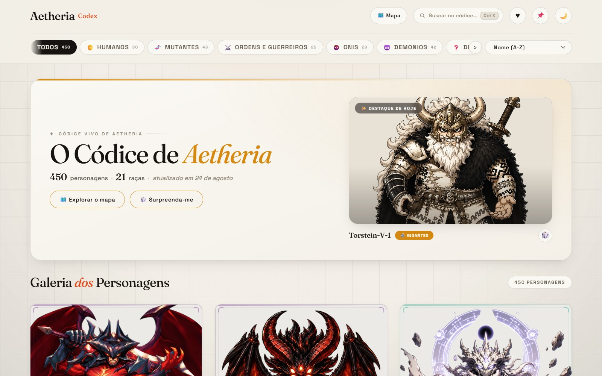
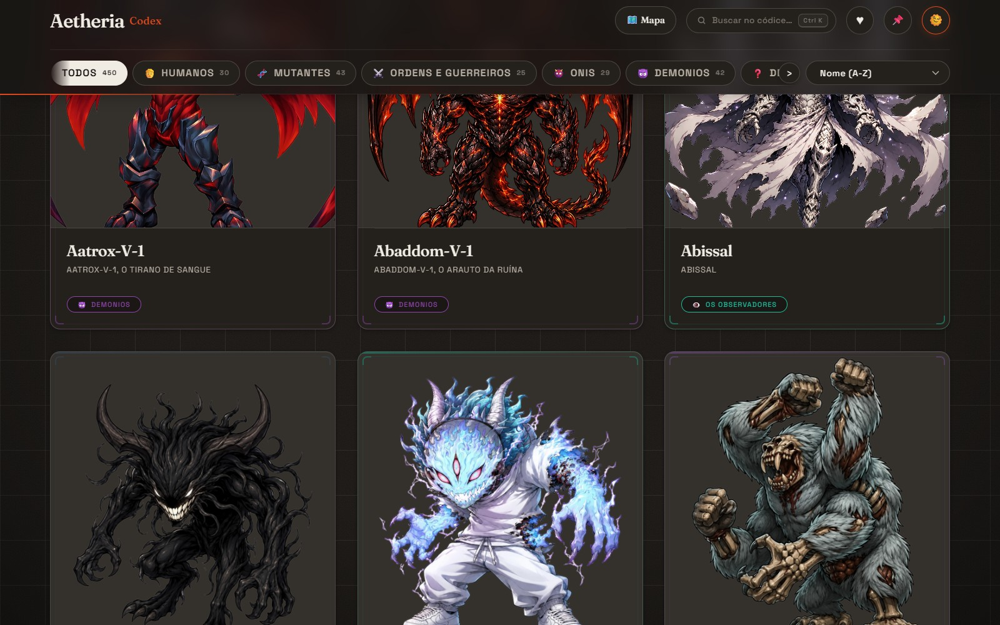
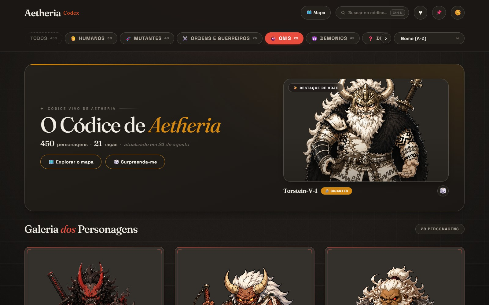
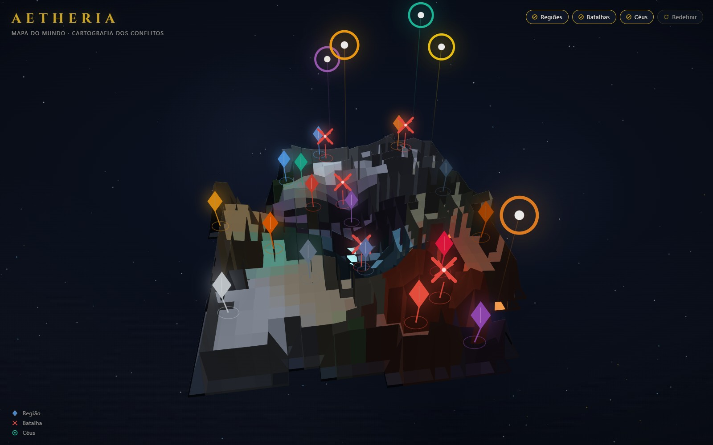
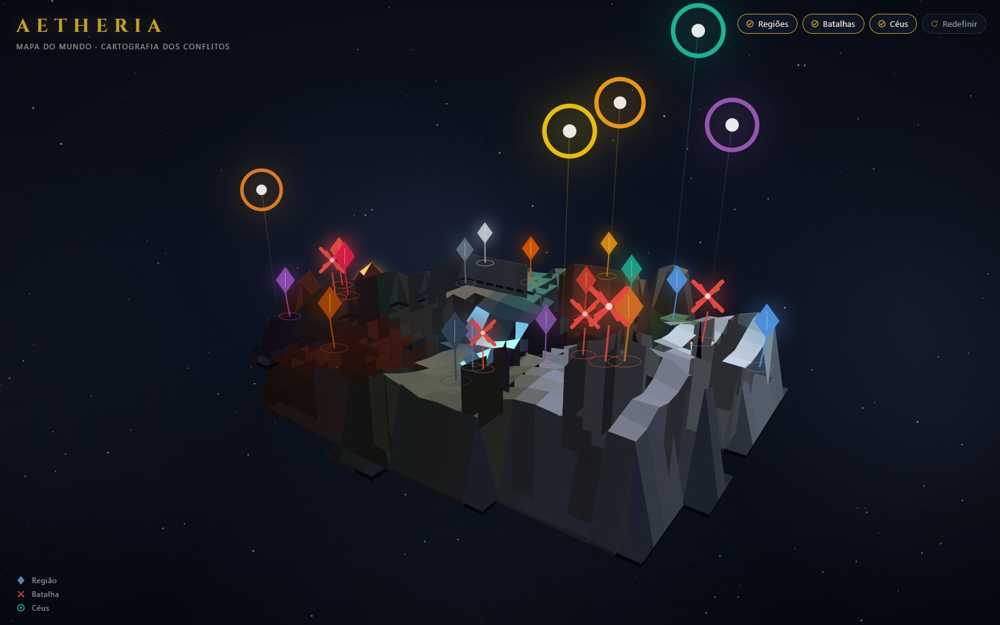

# README - Aetheria Codex

> 🤖 **Para assistentes de IA (Claude e similares):** ao iniciar uma conversa sobre este projeto, leia este README por inteiro para entender a estrutura, E DEPOIS LEIA [`Memoria.md`](Memoria.md) — é a linha do tempo oficial com todas as alterações, erros já resolvidos, lições técnicas (armadilhas de PowerShell 5.1) e pendências. Ao terminar qualquer manutenção, adicione uma entrada lá com data/hora e commit.

> 💡 **Prompt sugerido para iniciar uma nova conversa:** *"Leia o README.md e o Memoria.md deste projeto para absorver todo o contexto antes de qualquer tarefa."*

---

## O que é este projeto

**Aetheria Codex** é um códice de personagens de fantasia autoral: **464 personagens** distribuídos em **22 categorias/raças**, cada um com ficha em Markdown (história + descrição visual detalhada) e arte `.png`. Sobre esse acervo roda um site galeria estático — sem backend, sem dependências, só HTML/CSS/JS puro.

O fluxo é: **fichas `.md` nas pastas → scripts PowerShell geram `characters-api.json` e `README.md` → `index.html` consome a API JSON**.

## 📸 Galeria do Site

**Home — hero com stats e destaque do dia** (tema claro): contadores animados (464 personagens · 22 raças), destaque determinístico pelo dia do ano (com reroll 🎲) e CTAs para o mapa e "Surpreenda-me".



**Cards "Carta do Códice"** (tema escuro): moldura de manuscrito com cantos que crescem no hover, tilt 3D, foil holográfico que segue o ponteiro, filete e badge na cor da raça, blur-up das artes.



**Filtro por raça:** chips compactos em linha rolável; o ativo é preenchido com a cor da categoria (aqui Onis) e a seleção fica na URL (`#g=04_Onis`) — deep-link compartilhável.



**Modal folheável:** morf card→modal (View Transitions), abas 📜 História (com lore da raça) e 🧬 Ficha técnica, navegação ‹ › + teclas ←→ com contador "N / M", copiar link e focus trap.


**Paleta de comandos (Ctrl+K ou /):** busca fuzzy insensível a acentos com ranking global — personagens, raças e ações no mesmo resultado (digitar "aat" já traz o Aatrox).


**Mapa "Mesa de Guerra Arcana":** mundo 3D em Canvas 2D puro (sem bibliotecas), câmera orbital (arrasto/roda/pinça) e 26 pins — 16 regiões, 5 batalhas e 5 céus — alimentados pelo `historia-api.json`.



**Outros ângulos da câmera orbital** — arrastar gira e inclina o mundo; aqui em vista girada, com os penhascos do relevo em primeiro plano e a geleira à direita:



**Pin selecionado:** o painel lateral traz a lore do local (aqui as Cavernas de Obsidiana, casa dos Onis) e o chip HABITANTES com a contagem de personagens — clicável, leva à galeria já filtrada.


**Vista rasante:** com a câmera quase na horizontal o relevo aparece de perfil — penhascos em silhueta, vulcão com lava emissiva e os pins dos céus flutuando sobre o mundo.


**Página de raça** (1 das 22, todas geradas por `scripts\\build_racas.ps1`): herói rotativo com autoplay, reveal por caractere, tilt/glare na arte, chips de atributos e deep-link por personagem.


**Acervo da raça:** todos os membros clicáveis (abrem o herói), navegação entre as 22 raças e dados embutidos na própria página — funciona até abrindo o arquivo direto (`file://`).


## Estrutura do Projeto

| Caminho | Função |
|---|---|
| `codex/` | As 22 pastas numeradas (`codex\\01_Humanos` a `codex\\22_Bersek`) — uma categoria/raça por pasta; dentro, o arquivo `Aetheria_Codex_de_*.md` com as fichas + os PNGs dos personagens |
| `index.html` | Site galeria (tema claro/escuro, busca, filtros por categoria, modal com descrição) |
| `racas/` | 22 páginas de raça geradas pelo `scripts\\build_racas.ps1` — showcase rotativo dos membros, lore, acervo e navegação entre raças (dados embutidos, funciona em file://) |
| `Historia/` | Lore autoral do mundo (narrativa livre) + `Aetheria_Dados_do_Mundo.md`, a fonte estruturada da API da história |
| `characters-api.json` | API estática gerada — única fonte de dados do site |
| `historia-api.json` | API estática da história (regiões, celestes, batalhas e raças) gerada pelo `scripts\\build_historia_api.ps1` — consumida pelo mapa |
| `Memoria.md` | 📌 Linha do tempo do projeto: alterações, erros/correções, pendências — LER PRIMEIRO |
| `graphify-out/` | 🕸️ Grafo de conhecimento do projeto (skill `/graphify`) — ver seção própria abaixo |
| `docs/screenshots/` | 📸 Capturas de tela do site usadas nesta documentação |
| `scripts/` | Scripts PowerShell de build e manutenção: `build_api_json.ps1`, `build_historia_api.ps1`, `build_racas.ps1`, `build_readme.ps1`, `check_missing_images.ps1`, `dedupe_images.ps1`, `fix_encoding.ps1`, `fix_image_typos.ps1` |

## 🖥️ Como as Telas Funcionam

### `index.html` — galeria "Evolução Premium"

- **Dados:** tudo vem do `characters-api.json` via `fetch()` (por isso precisa de servidor local — ver "Como Rodar o Site"). Sem backend, sem dependências.
- **Hero:** contadores count-up em `requestAnimationFrame`, **destaque do dia determinístico** (dia-do-ano % total, reroll 🎲) e glow ambiente tingido pela cor da raça do destaque.
- **Cards-carta:** tilt 3D com um único loop rAF para o card sob o cursor; foil holo `color-dodge` guiado pela posição do ponteiro (só em `hover: fine` e sem `prefers-reduced-motion`); blur-up das artes; primeira dobra com `fetchpriority=high`, resto lazy.
- **Modal folheável:** morph card→modal via **View Transitions** (o `view-transition-name` é atribuído só durante a transição e limpo no fim — nome duplicado quebra o snapshot); abas História/Ficha; navegação por teclas ←→ sobre os resultados filtrados com deep-link `#<id>`; focus trap de verdade (Tab não escapa); lore da raça vem do `historia-api.json` (fetch tolerante a falha).
- **Paleta Ctrl+K** (ou `/`): personagens + 22 raças + ações num **mesmo ranking global** com desempate por tipo; matching fuzzy insensível a acentos; ARIA combobox completo; vira folha no mobile.
- **URL state:** `#g=&q=&sort=&fav=` — compatível com deep-links antigos (`#<pasta>` do mapa e `#<personagem>`); filtros, busca e favoritos sobrevivem a reload e são compartilháveis.
- **Auto-load:** sentinel com IntersectionObserver (rootMargin 900px) carrega mais cards ao rolar; o botão "Carregar mais" continua como fallback e é o caminho único com reduced-motion.
- **Temas:** 22 cores/ícones de raça aplicados a cards, modal, filtros e glow; claro/escuro (a 1ª visita respeita `prefers-color-scheme`); tema, favoritos e header fixado persistem em `localStorage`; personagem sem arte ganha placeholder local desenhado (monograma + hachura na cor da categoria).

### `racas/*.html` — 22 páginas de raça (geradas)

- **Geradas por `scripts\\build_racas.ps1`** a partir da API — nunca edite os HTMLs à mão: mude o template do script e regenere. Guard interno confere a soma de membros contra o JSON.
- **Dados embutidos** no payload `#race-data` dentro de cada página → funciona em `file://`, sem servidor e sem fetch.
- **Herói rotativo:** autoplay de 7s com barra de progresso nos dots, trocas animadas por WAAPI, reveal do nome por caractere, tilt 3D + glare + Ken Burns na arte; a pausa por hover vale SÓ no palco (não na página inteira) e `focusin` pausa no herói todo (acessibilidade).
- **Deep-link `#<id>`** abre direto no personagem (listener `hashchange` cobre navegação same-document); ficha lateral mostra os 6 atributos da ficha; acervo clicável; setas ‹ › e índice das 22 raças; tema persistido em `localStorage.racasTheme`.
- **Reveals à prova de falha:** o conteúdo nasce VISÍVEL no CSS; o estado oculto `.pre-reveal` só é aplicado via JS quando `IntersectionObserver` existe, com sweep de segurança de 900ms — sem JS ou com IO morto, nada fica invisível (lição do "bug dos reveals", ver `Memoria.md`).

### `Mapa_Aetheria.html` — Mesa de Guerra Arcana

- **Canvas 2D puro** (zero bibliotecas): heightmap procedural com biomas por região, câmera orbital (arrasto/roda/pinça/duplo-clique reset), painter algorithm com flat shading e névoa, lava conectada e veios emissivos.
- **26 pins clicáveis** (16 regiões + 5 batalhas + 5 céus) consumindo `historia-api.json`, com fallback embutido completo para `file://` (o fetch é pulado sem ruído).
- **Painel lateral** com a lore do local e chips HABITANTES/COMBATENTES que abrem a galeria filtrada (`index.html#<pasta>`) — fecha o circuito mapa↔galeria↔APIs.
- **Camadas** Regiões/Batalhas/Céus ligáveis; navegação por teclado; `prefers-reduced-motion`; no mobile o painel vira bottom-sheet.
- **API de diagnóstico `window.__MAPA__`:** `estado()` (câmera, painel, camadas), `abrir(id)`, `camera({yaw,pitch,dist})`, `telaDePOI(id)` e `ids()` — feita para testes automatizados; foi assim que as capturas de outros ângulos do README foram tiradas (o mapa é Canvas, pins não são elementos do DOM).

## Formatos das Fichas (.md)

Cada personagem começa numa linha numerada (`## N. Nome, epíteto` ou `N. Nome`) e os campos podem aparecer em **três estilos** — o parser da API aceita todos:

1. **Bulleted-bold** (ex.: Humanos): `- **História Original:** texto...`
2. **Texto simples** (ex.: Monstros): campos como parágrafos `História Original:` seguidos de linha em branco
3. **Esquema Mutantes**: rótulos próprios — `Classe Mutagênica:`, `Anatomia & Detalhes:`, `Atributos Únicos:`

Rótulos reconhecidos pelo parser (com variações): História Original · Raça/Categoria/Ordem/Classe Mutagênica/Demoníaca/Mutante · DNA & Raio-X Visual · Físico & Postura · Rosto & Cabelo/Anatomia/Detalhes · Vestuário · Paleta de Cores · Acessórios & Equipamento/Atributos Únicos.

## Regras Importantes

- **Encoding:** tudo em UTF-8; os `.ps1` precisam estar salvos **com BOM** (PowerShell 5.1). Nunca salvar `.md` em ANSI.
- **Imagens:** o matching é estrito (nome exato ou normalizado, sem reuso entre personagens). PNG com nome errado fica órfão de propósito — ver `Memoria.md` se quiser recuperá-lo.
- **README e API são gerados:** edite sempre os `.md` das pastas e regenere; nunca edite `README.md`/`characters-api.json` diretamente.
- **Git versiona só textos:** PNGs ficam fora via `.gitignore` (~1,3 GB).

## 🎛️ Comando «atualização de personagens»

Quando disser **"personagens atualizados"**, **"atualização de personagem(s)"**, **"atualizei o codex"** ou **"checar o que mudou"**, o assistente deve executar o checklist padrão documentado em [`Memoria.md`](Memoria.md) (seção COMANDOS): reparar encoding → comparar elenco por pasta → escanear imagens novas/órfãs/duplicadas → regenerar API+README → relatório do que precisa de `.md`, de edição ou de nomes.

## 🕸️ Grafo de Conhecimento (`/graphify`)

O projeto tem um **grafo de conhecimento navegável em [`graphify-out/`](graphify-out/)**, gerado pela skill `/graphify`: **343 nós / 447 arestas / 63 comunidades** ligando personagens, raças, regiões, batalhas, deuses, páginas do site e scripts de build (snapshot de 26/08/2026, já refletindo a reestruturação para `codex/`).

Arquivos: `graph.html` (visualização interativa — abra no navegador) · `GRAPH_REPORT.md` (relatório com god nodes, conexões surpreendentes e perguntas sugeridas) · `graph.json` (dados brutos do grafo) · `manifest.json` + `cost.json` (estado p/ atualização incremental).

**Para assistentes de IA:** ao responder perguntas sobre lore, personagens, regiões, batalhas ou arquitetura do site, consulte o grafo em vez de re-ler tudo:

- `/graphify query "pergunta"` — resposta atravessando o grafo (BFS amplo; `--dfs` rastreia um caminho; `--budget 1500` limita tokens)
- `/graphify path "Entidade A" "Entidade B"` — caminho mais curto entre dois conceitos
- `/graphify explain "NomeDoNo"` — explicação em linguagem simples de um nó
- `/graphify --update` — re-extrai só arquivos novos/alterados (rodar após mudanças grandes de conteúdo)

*O `graph.json` é um snapshot: depois de adicionar/editar muitas fichas ou páginas, rode `/graphify --update` para atualizá-lo.*

## Como Rodar o Site

O `fetch()` do JSON não funciona abrindo o arquivo direto no navegador (restrição de origem `file://`). Use um servidor local:

```powershell
# opção 1 - Python
python -m http.server 8080
# opção 2 - Node
npx serve .
```

Depois abra `http://localhost:8080`.

## Como Regenerar os Artefatos

```powershell
powershell -File scripts\build_api_json.ps1        # 1. gera characters-api.json a partir das fichas .md
powershell -File scripts\build_historia_api.ps1    # 2. gera historia-api.json a partir de Historia/Aetheria_Dados_do_Mundo.md
powershell -File scripts\build_readme.ps1          # 3. gera README.md a partir da API
powershell -File scripts\build_racas.ps1           # 4. gera as 22 páginas de raça em racas/
```

## Transições de Página (Rituais / `assets/transitions.js`)

O arquivo `assets/transitions.js` guarda todas as transições visuais entre páginas (rituais de invocação). Cada ritual é uma função `fn(cardEl, modalEl, groupColor)` exposta via `window.runRitual(groupKey, ...)`. A arquitetura é:

- `assets/transitions.js` — arquivo único com todos os rituais ativos (`03_Ordens_E_Guerreiros`, `07_Gigantes`, `08_Monstros`, `14_Demonios_Do_Caos`, `17_Meio_Sangue`, `19_Barbaros`, `05_Demonios`).
- `05_Demonios` — ritual exclusivo da raça dos Demônios. Cria um overlay fixo (`trans-05-stage`) com portão duplo (`.trans-05-gate.left` / `.right`), efeito de abertura (`rotateY` + `translateX`), partículas de brasa (`.trans-05-ember`), flash (`.trans-05-flash`) e vibração (`.trans-05-shake`). Duração total ~2700ms. O design visual é baseado no arquivo de referência `ritual-05.html` (removido após aplicação) — gates, cracks, runes, skull, chains, embers e audio procedural.
- `racas/demonios.html` — chama `runRitual('05_Demonios', document.body, null, '#8E44AD')` no `DOMContentLoaded`.
- `index.html` — guarda `char.folder !== '05_Demonios'` impede que o ritual dispare ao clicar no card (apenas na entrada direta da página da raça).
- `assets/rituals.js` — arquivo antigo; o ritual `05_Demonios` foi removido de lá e migrado para `assets/transitions.js`.
- `historia-api.json` — existe (`34569` bytes, `26/08/2026`) e é consumido pelo mapa (`Mapa_Aetheria.html`) e pelo modal de raça (`racas/*.html` via payload embutido `#race-data`).

### Como funciona o ritual dos Demônios (`05_Demonios`)

1. **Estilo dinâmico** — inserido uma vez (`#trans-05-style`) com `keyframes` de abertura (`gateLOpen`/`gateROpen`), pulsação (`seamPulse`), brasa ascendente (`rise`), relâmpago (`flash`) e tremor (`shake`).
2. **Overlay** — `.trans-05-stage` (fixo, `z-index: 9999`, sem interação) contém `.trans-05-portal` (agora `width:100%; height:100%; border-radius:0`).
3. **Portões** — `.trans-05-gate.left`/`.right` abrem com `rotateY` e `translateX`; dentro, `crackSVG`, `runeSVG`, `rivets`, `skullSVG`, `chainSVG` compõem a decoração.
4. **Partículas** — 26 `.trans-05-ember` sobem com `animation: rise`.
5. **Flash + Tremor** — `flash-hit` (opacidade branca) aos 250ms; `shake` aos 300ms; ambos removidos aos 1000ms.
6. **Remoção** — o estágio inteiro é removido após 2700ms (`runAfter(2700, ...)`).

### Explicação técnica

- **Zero dependências externas**: CSS + JS puro + SVG inline. Nenhuma biblioteca (sem `gsap`, sem `three.js`, sem `canvas` pesados).
- **Performance**: o `style` é inserido uma vez (`getElementById('trans-05-style')`) e o `stage` removido após a animação, evitando acúmulo no DOM.
- **Acessibilidade**: `pointer-events: none` no overlay; não bloqueia interação; `prefers-reduced-motion` pula a animação (`return` imediato).
- **Referência visual**: o arquivo `ritual-05.html` (removido) serviu de base para o design final aplicado em `assets/transitions.js`.

```powershell
# Regenerar artefatos (inclui transições no código)
powershell -File scripts\build_api_json.ps1
powershell -File scripts\build_historia_api.ps1
powershell -File scripts\build_readme.ps1
powershell -File scripts\build_racas.ps1
```

---

*Última atualização: 29/08/2026 — transições atualizadas em `assets/transitions.js`, ritual `05_Demonios` com design completo, arquivo `ritual-05.html` removido, `assets/rituals.js` limpo do ritual antigo, `historia-api.json` mantido como referência.*

## Resumo Por Categoria

Total: **464 personagens** em **22 categorias** (API gerada em 2026-08-27).

<details>
<summary><strong>01_Humanos</strong> — 24 personagens <code>Aetheria_Codex_de_Humano.md</code></summary>

Aokiji, o Sentinela do Gelo Eterno | Astrid, a Fúria das Montanhas de Ferro | Brakkus, o Colosso de Titanio | Broly, a Ira do Vórtice Astral | Davy Jones, o Barão do Abismo Profundo | Dragon, o Arconte do Vento Revolucionário | Enjin, o Nômade das Areias Quentes | Garp, o Punho do Imperador | J-V-3, o Cavaleiro da Chama Eterna | Laxus, o Senhor do Trovão Dourado | Maki, a Lâmina sem Sombra | Raiden, o Invicto do Círculo de Pedra | Rocks, o Flagelo dos Sete Mares | Scopper, o Mercenário dos Machados Duplos | Shanks, o Imperador da Vontade Suprema | Solaria, a Rapier de Luz Solar | Star, a Comandante da Ordem Suprema | Toji, o Caçador Sem Magia | Chougoukin-Kurobikari-V-1, o Titã de Metal Vivo | Emporio-Alnino, o Mestre da Corrente Viva | Irelia, a Dançarina da Lâmina de Flores | Kaelen-V-1, o Vigia das Ruínas Douradas | Sakata-Kintoki-V-1, o Herói do Machado Áureo | Shamrock, o Espadachim da Coroa Partida

</details>

<details>
<summary><strong>02_Mutantes</strong> — 43 personagens <code>Aetheria_Codex_de_Mutantes.md</code></summary>

All-For-One-V-1 | Aegis-Prime-V-1 | Bloodfang-V-1 | Bone-Kore-V-1 | Borok-V-1 | Crush-V-1 | Dracorex-V-1 | Echo-Kore-V-1 | Fenrir-Rugidor-V-1 | Frostbite-V-1 | Gale-V-1 | Gargoyle-V-1 | Genzo-V-1 | Gorefist-V-1 | Gorgath-V-1 | Grimm-V-1 | Lobisomem-V-2 | Lobisomem-V-3 | Lobisomem-V-1 | Malagor-V-1 | Nomu-V-1 | Pyrowolf-V-1 | Rage-Kore-V-1 | Rin-Kore-V-1 | Savage-Mane-V-1 | Savage-V-1 | Scraptron-V-1 | Tri-Gorgon-V-1 | Ulthar | Valerion-V-1 | Valthier-V-1 | Vector-X-V-1 | Vespera | Vyrn-Wing-V-1 | Wargen-V-1 | Xylion-V-1 | Zephyros-V-1 | Zylithor-V-1 | Kruul-V-1, o Guardião da Crosta Primordial | Morrigan-V-1, a Soberana da Lua Corrompida | Tusker-V-1, o Búfalo de Guerra Infinita | Venath-V-1, a Predadora da Névoa Rubra | Vespis-V-1, a Rainha dos Ferrões de Prata

</details>

<details>
<summary><strong>03_Ordens_E_Guerreiros</strong> — 22 personagens <code>Aetheria_Codex_de_Ordens_e_Guerreiros.md</code></summary>

Frostmourne-V-1 | Grom-V-1 | Ironshroud-V-1 | Kaldor-Kore | Ksante-V-1 | Leonidas-V-1 | Lord-Kaelthorn | Maw-Shin | Mortalis-V-1 | Nameless-King-V-1 | Pyroth-V-1 | Skull-Knight-V-1 | Solano-V-1 | Soul-of-Cinder-V-1 | Thrum-V-1 | Uriel-V-1 | Vesperion | Vorgreth | Vorgrim-Ironspine | Vulcan-V-1 | Xerxes | Zephyrus-V-1

</details>

<details>
<summary><strong>04_Onis</strong> — 27 personagens <code>Aetheria_Codex_de_Onis.md</code></summary>

Akuma-Ghen-V-1 | Akuma-V-1 | Brutalus-V-1 | Enma-Okon-V-1 | General-Krogan-V-1 | Grakthor-V-1 | Kaguro-V-1 | Kagutsuchi-Kore-V-1 | Khorvath-V-1 | Kore-Magma-V-1 | Kurenai-Rage-V-1 | Kurogane-Enma-V-1 | Kurokaze-V-1 | Kyofu-Kore-V-1 | Kyo-Zen-V-1 | Onikar-V-1 | Raijin-Kore-V-1 | Ryu-Kore-V-1 | Vulkathor-V-1 | Xan-Drakar-V-1 | Zanka-Kore-V-1 | Zan-Kuro-V-1 | Zen-Kore-Shin-V-1 | Zorthar-V-1 | Akatoran-V-1 | Hakuzen-V-1 | Kagezangetsu-V-1

</details>

<details>
<summary><strong>05_Demonios</strong> — 42 personagens <code>Aetheria_Codex_de_Demônios.md</code></summary>

Aatrox-V-1, o Tirano de Sangue | Abaddom-V-1, o Arauto da Ruína | Apoliom-V-1, o Flagelo Infernal | Belial-V-1, o Lorde da Corrupção | Black-Sperm-V-1, a Sombra Singular | Cyber-Gore-V-1, o Algoz Tecnológico | Denji-V-1, o Demônio da Serra | Drakhar, o Senhor dos Bárbaros Caídos | Drakon-Ghen-V-1, o Dragão Abissal | Dread-V-1, o Espreitador dos Pesadelos | Garrison-V-1, o Executor de Aço Negro | Golden-Sperm-V-1, o Imperador Reluzente | Golgoth-V-1, o Titã Sombrio | Grunbeld-V-2, o Dragão de Prata | Ignarok-V-1, o Destruidor Vulcânico | Kaelthas-V-1, o Feiticeiro Espectral | Kokushibo-V-1, o Primeiro Espadachim Demônio | Monspiet-V-1, o Cavalheiro da Chama Negra | Mordecai-V-1, o Satírico do Abismo | Nalakor-V-1, o Sacerdote das Asas Caídas | Nocthira-V-1, a Dama das Rosas Negras | Nocth-V-1, o Anjo do Aniquilamento | Obsidius-V-1, o Berserker Rochoso | Onyx-V-1, o Autômato Sombrio | Oongway-V-1, o Mestre do Sangue Antigo | Orochi-V-1, o Rei das Múltiplas Serpentes | Platinum-Sperm-V-1, a Velocidade Absoluta | Pyros-V-1, o Incendiário do Abismo | Sad-Sperm-V-1, o Lamento Silencioso | Shadowweaver-V-1, o Tecelão do Tormento | Sion-V-1, o Colosso Imparável | Surtur-V-1, o Gigante do Apocalipse | Swain-V-1, o Estrategista Demoníaco | Thul-V-1, o Eremita dos Chifres Prateados | Topo-V-1, o Titã Violeta | Umbras-V-1, o Rei da Penumbra Fendida | Valdrak-V-1, o Dragão de Armadura Carmesim | Vyrnath-V-1, a Sombra Rastejante | Xar-Koth-V-1, o Lorde do Círculo Rúnico | Yoru-V-1, a Criança da Maledicência | Yrul-V-1, o Anjo Demoníaco Agachado | Zoran-V-1, o Mestre do Vento Sombrio

</details>

<details>
<summary><strong>06_Desconhecidos</strong> — 15 personagens <code>Aetheria_Codex_de_Desconhecidos.md</code></summary>

Astra-V-1 | Aurelion-V-1 | Corvusgrem-V-1 | Dreadcleaver | Helioth-V-1 | Kyran-V-1 | Noxaris | Noxaris-V-1 | Nyxaris-V-1 | Stellaris-V-1 | Trifacies | Vanek-V-1 | Corpus-Karmex-V-1 | Glorivex-V-1 | Mimesis-Solar-V-1

</details>

<details>
<summary><strong>07_Gigantes</strong> — 26 personagens <code>Aetheria_Codex_de_Gigantes.md</code></summary>

Asura-V-1 | Azure-Kore-V-1 | Bjornar-V-1 | Bjorn-V-1 | Brawn-V-1 | Charizard | Crimson-V-1 | Elbaf-V-1 | Golem-V-1 | Harald-V-1 | Hydraskull-V-1 | Kabuto-V-1 | Katsu-V-1 | Kos-V-1 | Ladon-V-1 | Loki-V-1 | Nidhogg-V-1 | Pyreus-V-1 | Radahn-V-1 | Torstein-V-1 | Typhon-V-1 | Zinogre-V-1 | Zorthak-V-1 | Zrik-V-1 | Malgorg-V-1, o Colosso da Falha de Basalto | Nyxthos-V-1, o Gigante do Eclipse Frio

</details>

<details>
<summary><strong>08_Monstros</strong> — 37 personagens <code>Aetheria_Codex_de_Monstros.md</code></summary>

Battle-Beast-V-1 | Behemoth-V-1 | Besouro-V-1 | Davy-Jones-V-1 | Drakul-Zar-V-1 | Dredgor-V-1 | Garchomp-V-1 | Gargul-V-1 | Glacius-V-1 | Gloop-V-1 | Gnash-V-1 | Gorathos-V-1 | Gorgoroth-V-1 | Guardian-Ape-V-1 | Ignisaurus-V-1 | Karkas-V-1 | Kongor-V-1 | Kragor-V-1 | Kragos-V-1 | Magmoros-V-1 | Magnar-V-1 | Morbidus-V-1 | Necros-V-1 | Nero-V-1 | Nihilus-V-1 | Ossifago-V-1 | Pyrogon-V-1 | Pyroxen-V-1 | Ratatoskr-V-1 | Root-V-1 | Shao-Kahn-V-1 | Vermithrax-V-1 | Vexor-V-1 | Volcanus-V-1 | Vorgas-V-1 | Zarich-V-1 | Ghul-Drakar-V-1

</details>

<details>
<summary><strong>09_Semi_Deuses</strong> — 31 personagens <code>Aetheria_Codex_de_Semideuses.md</code></summary>

Aethel-V-1 | Aether-Kore-V-1 | Astrolon-V-1 | Aureon-V-1 | Aurion-V-1 | Azazel-V-1 | Dio-Heaven-V-1 | Enel-V-1 | Haku-V-1 | Hercules-V-1 | Ignis-V-1 | Imu-V-1 | Malenia-V-2 | Morthan-V-1 | Nika-V-1 | Ossuaria-V-1 | Radagon-of-the-Golden-Order-V-1 | Shikon-Kore-V-1 | Skarner-V-1 | Skel-Shin-V-1 | Sun-Wukong-V-1 | Volthazar-V-1 | Xul'gath-V-1 | Zaza-V-1 | Dividade-V-1 | Rei-Demonio-V-1, o Soberano da Queda | Solenya-V-1, a Filha da Aurora Viva | Sun-Apeiron-V-1, o Infinito Incandescente | Sylvaris-V-1, o Regente do Bosque Celeste | Thalric-V-1, o Maré-Forte | The-Radiance-V-1, a Última Claridade

</details>

<details>
<summary><strong>10_Os_Observadores</strong> — 9 personagens <code>Aetheria_Codex_de_Observadores.md</code></summary>

Auroris | Ecliptus | Meridianis | Nyxaris | Stellaris | Umbralis | Vorlaris | Abissal | Orbe-Negro

</details>

<details>
<summary><strong>11_Seres_Do_Vazio</strong> — 20 personagens <code>Aetheria_Codex_de_Seres_do_Vazio.md</code></summary>

Abyss-Maw-V-1 | Akuma-Zan-V-1 | Alaric-V-1 | Apex-V-1 | Astrion-V-1 | Erebus-V-1 | Kael'thas-V-1 | Kael-V-1 | Kallysta-V-1 | Kalthazar-V-1 | Koku-Kore-V-1 | Korvessa-Nightlash-V-1 | Kraivos-V-1 | Krown-Kore-V-1 | Mahoraga-V-1 | Malakor-V-1 | Multi-Supreme-V-1 | Oblivion-V-1 | Wraith-V-1 | Xanthos-V-1

</details>

<details>
<summary><strong>12_Magos</strong> — 23 personagens <code>Aetheria_Codex_de_Magos.md</code></summary>

Abyssal-V-1 | Aetheron | Baelor Hellfire | Corvus-V-1 | Drakhen-V-1 | Dravok-V-1 | Gowther-Original-1 | Hajime | Ignisara-V-1 | Infernus Ember | jin-enjoji-V-1, o Arquivista do Selo Ardente | Kaelen Ignis | Kagutsuchi-Ren-V-1, o Herdeiro da Chama Divina | Lucien-Blackthorn-V-1, o Mago das Trevas Nobres | Malakai-V-1 | Melina-V-1 | Mortis-V-1 | Shinso-V-1 | Thomas-V-1 | Valerius-V-1, o Mestre da Maré Arcana | Vanek | Void-V-1 | Zephyr-V-1

</details>

<details>
<summary><strong>13_Deuses</strong> — 18 personagens <code>Aetheria_Codex_de_Deuses.md</code></summary>

Bone-Plume-V-1 | Clangoro-V-1 | Gorvum-V-1 | Kaminari-V-1 | Oculon-V-1 | Ossuarion-V-1 | Renji-V-1 | Saint-Vail-V-1 | Solkhamun-V-1 | Solvain-V-1 | Ulthar | Valeriana-V-1 | Vanek | Vyrn-V-1 | Aethon-Sol-V-1, o Pai do Disco Incandescente | Florivax, a Deusa das Estações Vivas | Mycelium-V-1, o Deus do Subsolo Silencioso | Pyrhen-V-1, o Deus da Cinza Sagrada

</details>

<details>
<summary><strong>14_Demonios_Do_Caos</strong> — 11 personagens <code>Aetheria_Codex_de_Demônios_do_Caos.md</code></summary>

Aetheron | Florivax | Garrion-V-1 | Jinx-V-1 | Maw-Shin | Maw-Shin-V-1 | Nyxar | Stellaris | Vespera-Jest-V-1 | Harlex-V-1, o Rasgador de Ecos | Mimikor-V-1, a Risada da Ruína

</details>

<details>
<summary><strong>15_Os_Aspectos</strong> — 9 personagens <code>Aetheria_Codex_de_Aspectos.md</code></summary>

Aurelion, o Aspecto do Caos Magmático | Auriel-Bane, o Aspecto do Sol Dourado | Fulminox, o Aspecto da Tempestade Fulgurante | Kyran, o Aspecto da Forja Vulcânica | Corvax, o Aspecto do Presságio | Eonis-V-1, o Aspecto da Eternidade | Garrion, o Aspecto da Ruína Santa | Solvyr-V-1, o Aspecto da Harmonia Ardente | Umbryx-V-1, o Aspecto da Penumbra Profunda

</details>

<details>
<summary><strong>16_Alvamortos</strong> — 20 personagens <code>Aetheria_Codex_de_Alvamortos.md</code></summary>

Cyclor-V-1, o Ciclope do Selo Espiritual | Espiral, o Mestre do Vórtice Espiritual | Jinkai, o Monge do Juramento Sombrio | Kage-Rin, o Príncipe das Sombras Silenciosas | Kanshorin, o Titã da Auréola de Pedra | Maelstrom, o Vórtice de Almas Agitadas | Mogara, o Guardião das Profundezas | Oboroshin, o Fantasma da Lua Sangrenta | Omen-V-1, o Mensageiro do Eclipse Sagrado | Orokuzan, o Imperador da Montanha de Ferro | Reigetsu, o Santo Patriarca das Chamas Frias | Renshomaru, o Guerreiro do Manto das Sombras | Rudoraka, o Carcereiro dos Ossos Vazios | Sankai, o Eremita da Névoa Ancestral | Tenshuro, o Arquiteto do Labirinto de Almas | Yagama, o Caçador de Sombras | Yambara, a Sacerdotisa da Cinza Serena | Zagetsu, o Ceifador do Crepúsculo Negro | Zangetsuo, o Guardião do Vazio Eterno | Zangureki, o Carrasco do Trovão Negro

</details>

<details>
<summary><strong>17_Meio_Sangue</strong> — 18 personagens <code>Aetheria_Codex_de_Meio_Sangue.md</code></summary>

Barba-Branca-V-1, o Almirante dos Mares Distantes | Boreas-V-1, o Titã das Montanhas Geladas | Ibaraki-V-1, o Demônio da Escama Roxa | Kaido-V-1, o Dragão de Chifres de Touro | Kakuzu-V-1, o Tanoeiro de Corações | Kross-V-1, o Pirata do Mar de Sangue | Kuma-V-1, o Tirano Pacifista | Muscular-V-1, o Berserker das Fibras Vivas | Satan-Soul-V-1, a Imperatriz Sucubus | Solan-V-1, o Guerreiro do Fogo Solar | Tentaku-V-1, o Guardião da Mente Abissal | Thalrok-V-1, o Rei Tritão do Tridente Sagrado | Thorne-V-1, o Cavaleiro Caído da Asa Negra | Vespera-V-1, a Dama da Noite Eterna | Jax-V-1, o Duelista do Sangue Raro | Kaelia-V-1, a Guardiã das Duas Linhagens | Katauri-V-2, a Voz da Noite Profunda | Saru-V-1, o Herdeiro da Fúria Selvagem

</details>

<details>
<summary><strong>18_Canibais</strong> — 21 personagens <code>Aetheria_Codex_de_Canibais.md</code></summary>

Dokuro-V-1, o Mascarado da Caveira Demoníaca | Ganshu-V-1, o Lutador dos Olhos de Éter | Goku-Maru-V-1, o Colosso do Estômago do Inferno | Kultar-V-1, o Wendigo do Chifre Flamejante | Ryogen-V-1, o Punho do Dragão Faminto | Soma-V-1, o Carrasco da Garra Branca | Sukuna-V-1, o Rei Absoluto das Mutações | Zankoku-V-1, o Flagelo dos Oito Braços | Akashura-V-1, o Ceifador da Fome Rubra | Dokan-V-1, o Cronista das Mandíbulas Rachadas | Fushu-V-1, o Arauto do Banquete Sem Fim | Gashu-V-1, o Artesão das Lâminas de Osso | Haru-V-1, o Jovem da Garganta Selvagem | Kurobane-V-1, o Executor da Asa Negra | Mugen-V-1, o Infinito da Carnificina | Nyxarar, o Senhor do Capuz do Eclipse | Reigen-V-1, o Punho do Julgamento Feral | Ryouka-V-1, a Caçadora da Lua Esfomeada | Shigoro-V-1, o Devorador de Tambores | Yatsura-V-1, o Silencioso das Costelas Vivas | Ranka-V-1, a Fera do Penhasco Carmesim

</details>

<details>
<summary><strong>19_Barbaros</strong> — 17 personagens <code>Aetheria_Codex_de_Barbaros.md</code></summary>

Dreadhelm-V-1, o Flagelo de Aço | Godfrey-First-Elden-Lord-V-1, o Rei leão dos Ermos | Gorak-V-1, o Caçador das Bestas Primordiais | Kragnar-V-1, o Carrasco de Sangue | Leon-V-1, o Berserker Descorrentado | Nosferatu-Zodd-V-1, o Ogro dos Picos Nevados | Ragnar-V-1, a Tempestade de Lâminas | Thorgan-Bloodaxe-V-1, o Bárbaro da Lâmina Sangrenta | Thorin-V-1, o Guardião de Ferro | Brynja-V-1, a Escudeira da Neve Selvagem | Grimrok-Ironhide-V-1, o Filho da Pele de Ferro | Helga-V-1, a Tempestade da Serra | Skald-V-1, o Cantor das Guerras Antigas | Torak-V-1, o Rompe-Montanhas | Ulfar-V-1, o Lobo do Crepúsculo | Ulfr-Wolfclan-V-1, o Herdeiro da Matilha | Varg-V-1, o Alfa da Ruptura

</details>

<details>
<summary><strong>20_Amaldiçoados</strong> — 8 personagens <code>Aetheria_Codex_de_Amaldiçoados.md</code></summary>

Crimson-Kore, o Inseto de Carmim | Pyre-V-1, o Rei Esqueleto da Chama Eterna | Scylla-V-1, a Sacerdotisa de Pedra Serpentina | Zenon-V-1, o Monge da Oração Abrasadora | Zoro-V-1, o Asura da Dupla Calamidade | Irma-Friede-V-1, a Santa do Gelo Quebrado | Ren-Kuro-V-1, o Portador da Noite Ferida | Takushiro-Ouma, o Asceta do Lamento

</details>

<details>
<summary><strong>21_Demonios_Akuma-Gani</strong> — 18 personagens <code>Aetheria_Codex_de_Demonios_Akuma-Gani.md</code></summary>

Imu-Nerona-V-1, a Coroa Flamejante | Imu-Malakor-V-1, o Arauto Alado | Imu-Gorgath-V-1, o Colosso Vigia | Imu-Brakka-V-1, o Esmagador de Reis | Imu-Kenshin-V-1, a Lâmina Silente | Imu-Morok-V-1, o Eremita de Sete Chifres | Imu-Raijin-V-1, o Trovão Espiral | Imu-Kusari-V-1, a Carcereira de Almas | Imu-Maguma-V-1, a Senhora das Fissuras | Imu-Ryoba-V-1, o Alabardeiro de Mil Olhos | Imu-Gokuen-V-1, o Pilar Ardente | Imu-Aegis-V-1, o Bastião Cinzento | Imu-Drakon-V-1, o Dracônico das Profundezas | Imu-Executer-V-1, a Carrasca Escura | Imu-Brawler-V-1, o Pugilista Sinistro | Imu-Kageblade-V-1, o Espada das Sombras | Imu-Spear-V-1, o Lanceiro Alado | Imu-Sumi

</details>

<details>
<summary><strong>22_Bersek</strong> — 5 personagens <code>Aetheria_Codex_de_Berseks.md</code></summary>

Ashura | Guts-V-1 | Kargan-V-1, o Portador do Voto Quebrado | Vhalor-V-1, o Devorador de Juramentos | Xathur-V-1

</details>

## API JSON — Formato dos Dados

```json
{
  "project": "Aetheria Codex",
  "generatedAt": "2026-08-27",
  "totalGroups": 22,
  "totalCharacters": 464,
  "groups":  [ { "folder": "...", "file": "...", "count": N, "characters": [...] } ]

> O array flat `"characters"` saiu do JSON em 26/08/2026: ele duplicava `groups[].characters` e já havia divergido uma vez. Derive a lista plana dos grupos quando precisar.
}
```

Cada personagem tem:

| Campo | Conteúdo |
|---|---|
| `number` | número na ficha |
| `title` | nome completo com epíteto ("X, o Y") |
| `name` / `id` | nome base (sem epíteto) |
| `file` / `folder` | origem no acervo |
| `image` | caminho relativo do PNG ou `null` |
| `description` | história original extraída |
| `attributes` | `race`, `physical`, `faceAndHair`, `outfit`, `palette`, `equipment` (quando existirem na ficha) |

### Exemplo de uso em JavaScript

```js
const api = await (await fetch("./characters-api.json")).json();

const gigantes = api.groups.find((grupo) => grupo.folder === "07_Gigantes");
console.log(gigantes.count);
console.log(gigantes.characters.filter((c) => c.folder === "07_Gigantes"));
```

---

*Última geração: 27/08/2026 22:58 por `build_readme.ps1`. Histórico e pendências: [`Memoria.md`](Memoria.md).*
---

---

## 📂 Arquivos Necessários para Entender o Projeto (leia nesta ordem)

Para compreender completamente este projeto, leia os seguintes arquivos na ordem sugerida:

1. **README.md** (este arquivo) — visão geral, estrutura e funcionamento
2. **Memoria.md** — linha do tempo oficial, alterações, erros resolvidos e pendências; leia PRIMEIRO em qualquer sessão
3. **index.html** — site galeria estático (consome `characters-api.json`)
4. **Mapa_Aetheria.html** — mapa 3D do mundo (consome `historia-api.json`)
5. **assets/transitions.js** — rituais de transição visual (invocação de cartas/modal)
6. **assets/rituals.js** — arquivo de rituais antigos (referência)
7. **characters-api.json** — API estática de personagens (gerada por `scripts/build_api_json.ps1`)
8. **historia-api.json** — API estática da história / mundo (gerada por `scripts/build_historia_api.ps1`)
9. **scripts/build_racas.ps1** — script que gera as 22 páginas de raça (`racas/`)
10. **docs/screenshots/** — capturas de tela para referência visual
11. **graphify-out/** — grafo de conhecimento (`/graphify`)
12. **codex/** — fichas `.md` e imagens `.png` dos 464 personagens (fonte primária)
13. **Historia/** — lore autoral e dados estruturados do mundo

